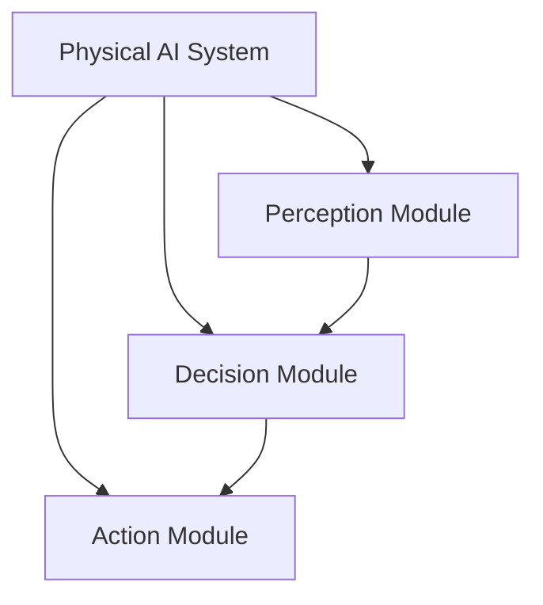

# Chapter 1: Intro to Physical AI

## Learning Objectives

After completing this chapter, you should be able to:
- Define Physical AI and its significance
- Understand the relationship between AI and robotics
- Identify key challenges in Physical AI

## Content with Code Examples

Physical AI is a field at the intersection of artificial intelligence and physical systems. It involves creating intelligent agents that can interact with the physical world through robotic systems.

```python
# Example of a simple robot controller
class RobotController:
    def __init__(self):
        self.position = [0, 0, 0]
        self.orientation = [0, 0, 0, 1]  # quaternion
    
    def move_to(self, target_position):
        # Calculate path to target
        path = self.calculate_path(self.position, target_position)
        # Execute movement
        for point in path:
            self.execute_movement(point)
    
    def calculate_path(self, start, end):
        # Simplified path calculation
        return [start, end]

controller = RobotController()
controller.move_to([1, 1, 0])
```

## Mermaid Diagrams



## Callouts

:::info Key Concept
Physical AI bridges the gap between digital AI and the physical world, requiring systems to understand and interact with real-world physics.
:::

:::tip Best Practice
When designing Physical AI systems, always consider the uncertainty inherent in real-world perception and actuation.
:::

:::warning Important
Real-world systems have physical constraints that digital simulations may not fully capture.
:::

## Exercises

1. Research a recent breakthrough in Physical AI and summarize its implications
2. Compare and contrast Physical AI with traditional AI approaches
3. Identify three challenges specific to Physical AI that don't exist in digital AI

## Key Takeaways

- Physical AI combines AI with physical systems and robotics
- It requires handling uncertainty and real-world physics
- Perception, decision-making, and action must be tightly integrated
