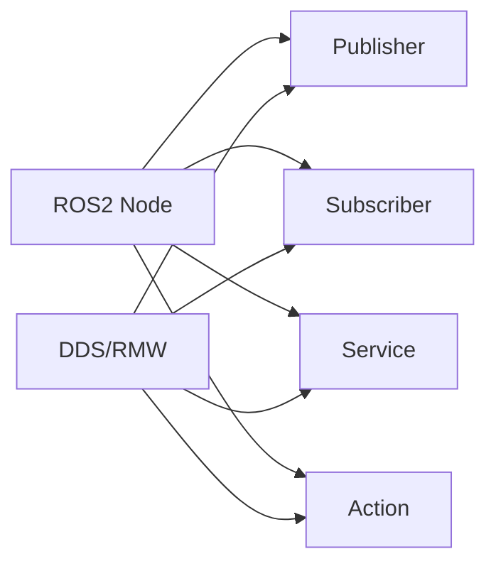

# Chapter 2: ROS2 Fundamentals

## Learning Objectives

After completing this chapter, you should be able to:
- Understand the architecture of ROS2
- Identify the key components of ROS2
- Create basic ROS2 nodes and topics

## Content with Code Examples

ROS2 (Robot Operating System 2) is a flexible framework for writing robot software. It's a collection of tools, libraries, and conventions that aim to simplify the task of creating complex and robust robot behavior across a wide variety of robotic platforms.

```python
# Example of a simple ROS2 publisher node
import rclpy
from rclpy.node import Node
from std_msgs.msg import String

class MinimalPublisher(Node):
    def __init__(self):
        super().__init__('minimal_publisher')
        self.publisher_ = self.create_publisher(String, 'topic', 10)
        timer_period = 0.5  # seconds
        self.timer = self.create_timer(timer_period, self.timer_callback)
        self.i = 0

    def timer_callback(self):
        msg = String()
        msg.data = 'Hello World: %d' % self.i
        self.publisher_.publish(msg)
        self.get_logger().info('Publishing: "%s"' % msg.data)
        self.i += 1

def main(args=None):
    rclpy.init(args=args)
    minimal_publisher = MinimalPublisher()
    rclpy.spin(minimal_publisher)
    minimal_publisher.destroy_node()
    rclpy.shutdown()

if __name__ == '__main__':
    main()
```

## Mermaid Diagrams



## Callouts

:::info Key Concept
ROS2 uses DDS (Data Distribution Service) as its underlying communication middleware, which enables better security, reliability, and real-time performance compared to ROS1.
:::

:::tip Best Practice
Always use ROS2's lifecycle management for complex nodes to ensure proper initialization and cleanup.
:::

:::warning Important
ROS2 has significant differences from ROS1, especially in terms of architecture and APIs. Don't assume direct compatibility.
:::

## Exercises

1. Create a ROS2 publisher that publishes the current timestamp every second
2. Create a ROS2 subscriber that listens to the publisher and logs the received messages
3. Research the different DDS implementations available for ROS2 and their tradeoffs

## Key Takeaways

- ROS2 is built on DDS for improved reliability and security
- It provides nodes, topics, services, and actions for communication
- Lifecycle management is crucial for complex robot systems
