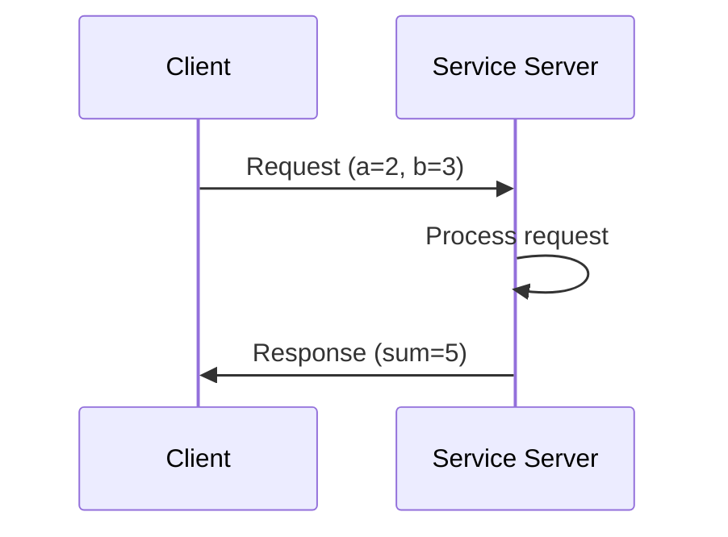
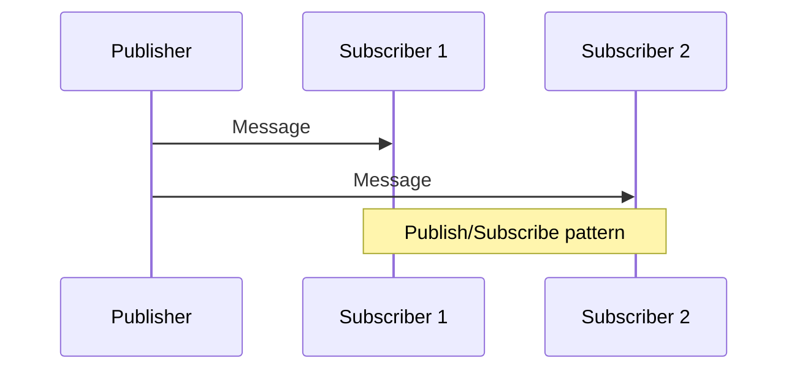

# Chapter 3: Communication Patterns

## Learning Objectives

After completing this chapter, you should be able to:
- Implement different ROS2 communication patterns
- Choose appropriate patterns for specific use cases
- Design efficient communication architectures

## Content with Code Examples

ROS2 offers several communication patterns: topics (publish/subscribe), services (request/reply), and actions (goal/cancel/feedback/result). Each pattern serves different communication needs.

```python
# Example of a ROS2 service server
import rclpy
from rclpy.node import Node
from example_interfaces.srv import AddTwoInts

class MinimalService(Node):
    def __init__(self):
        super().__init__('minimal_service')
        self.srv = self.create_service(AddTwoInts, 'add_two_ints', self.add_two_ints_callback)

    def add_two_ints_callback(self, request, response):
        response.sum = request.a + request.b
        self.get_logger().info('Incoming request\na: %d b: %d' % (request.a, request.b))
        return response

def main(args=None):
    rclpy.init(args=args)
    minimal_service = MinimalService()
    rclpy.spin(minimal_service)
    rclpy.shutdown()

if __name__ == '__main__':
    main()
```

## Mermaid Diagrams





## Callouts

:::info Key Concept
Topics provide asynchronous, broadcast communication; Services provide synchronous, request-response communication; Actions provide asynchronous communication with feedback for long-running operations.
:::

:::tip Best Practice
Use topics for streaming sensor data, services for configuration changes or simple computations, and actions for complex tasks that may take time.
:::

:::warning Important
Be careful with message frequency on topics to avoid overwhelming the network and subscribers.
:::

## Exercises

1. Implement a ROS2 service that calculates the factorial of a number
2. Create a ROS2 action that moves a robot to a goal position with feedback
3. Design a communication architecture for a multi-robot system using all three patterns

## Key Takeaways

- Topics: Asynchronous, broadcast communication
- Services: Synchronous, request-response communication
- Actions: Asynchronous with feedback for long-running operations
