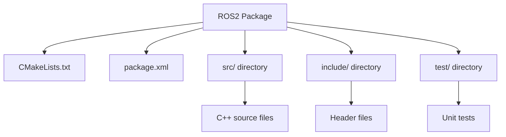

# Chapter 4: Building Packages

## Learning Objectives

After completing this chapter, you should be able to:
- Create ROS2 packages with proper structure
- Use CMake and colcon for building
- Manage dependencies in ROS2 packages

## Content with Code Examples

A ROS2 package follows a specific structure with CMakeLists.txt for C++ packages or setup.py for Python packages. The colcon build system is used to compile packages.

```cmake
# CMakeLists.txt example
cmake_minimum_required(VERSION 3.8)
project(my_robot_package)

if(CMAKE_COMPILER_IS_GNUCXX OR CMAKE_CXX_COMPILER_ID MATCHES "Clang")
  add_compile_options(-Wall -Wextra -Wpedantic)
endif()

# Find dependencies
find_package(ament_cmake REQUIRED)
find_package(rclcpp REQUIRED)
find_package(std_msgs REQUIRED)

# Add executable
add_executable(talker src/talker.cpp)
ament_target_dependencies(talker rclcpp std_msgs)

# Install executables
install(TARGETS
  talker
  DESTINATION lib/${PROJECT_NAME}
)

ament_package()
```

```python
# setup.py example for Python package
from setuptools import setup

package_name = 'my_robot_package'

setup(
    name=package_name,
    version='0.0.0',
    packages=[package_name],
    data_files=[
        ('share/ament_index/resource_index/packages',
            ['resource/' + package_name]),
        ('share/' + package_name, ['package.xml']),
    ],
    install_requires=['setuptools'],
    zip_safe=True,
    maintainer='Your Name',
    maintainer_email='your.email@example.com',
    description='TODO: Package description',
    license='TODO: License declaration',
    tests_require=['pytest'],
    entry_points={
        'console_scripts': [
            'talker = my_robot_package.talker:main',
        ],
    },
)
```

## Mermaid Diagrams



## Callouts

:::info Key Concept
Each ROS2 package should have a single, well-defined purpose and be easily reusable in other projects. Follow the single responsibility principle.
:::

:::tip Best Practice
Use meaningful names for your packages and document their purpose in the package.xml file. Include maintainers, license, and dependencies.
:::

:::warning Important
Always run tests before building and ensure your package doesn't have circular dependencies.
:::

## Exercises

1. Create a new ROS2 package with a simple publisher node
2. Add dependencies to your package and use them
3. Write and run unit tests for your package

## Key Takeaways

- Packages have standardized structure and configuration files
- CMakeLists.txt for C++ packages, setup.py for Python packages
- Proper dependency management is crucial
