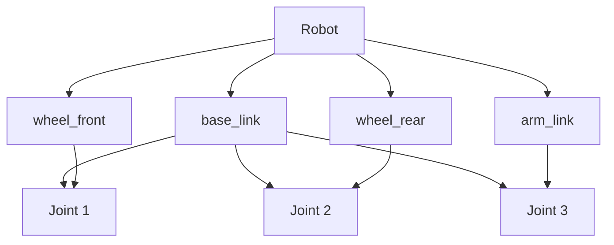

# Chapter 5: URDF

## Learning Objectives

After completing this chapter, you should be able to:
- Create URDF files for robot models
- Understand the structure and components of URDF
- Visualize and validate robot models

## Content with Code Examples

URDF (Unified Robot Description Format) is an XML format used to describe robot models in ROS. It defines the robot's physical and visual properties, including links, joints, and materials.

```xml
<?xml version="1.0"?>
<robot name="simple_robot">
  <!-- Base link -->
  <link name="base_link">
    <visual>
      <geometry>
        <box size="0.5 0.5 0.2"/>
      </geometry>
      <material name="blue">
        <color rgba="0 0 0.8 1"/>
      </material>
    </visual>
    <collision>
      <geometry>
        <box size="0.5 0.5 0.2"/>
      </geometry>
    </collision>
    <inertial>
      <mass value="1"/>
      <inertia ixx="0.1" iyy="0.1" izz="0.1" ixy="0" ixz="0" iyz="0"/>
    </inertial>
  </link>

  <!-- Wheel links -->
  <link name="wheel_front">
    <visual>
      <geometry>
        <cylinder radius="0.1" length="0.05"/>
      </geometry>
    </visual>
  </link>

  <!-- Joint connecting wheel to base -->
  <joint name="front_wheel_joint" type="continuous">
    <parent link="base_link"/>
    <child link="wheel_front"/>
    <origin xyz="0.2 0 -0.05" rpy="0 0 0"/>
    <axis xyz="0 1 0"/>
  </joint>
</robot>
```

## Mermaid Diagrams



## Callouts

:::info Key Concept
URDF describes the robot's kinematic and dynamic properties, including links (rigid bodies), joints (connections between links), and materials (visual appearance).
:::

:::tip Best Practice
Use the \`xacro\` extension for more complex robots to define macros and reuse components. This makes URDF files more maintainable.
:::

:::warning Important
Ensure all links have unique names and all joints have parent and child links that exist. Check that inertial properties are properly defined to avoid simulation errors.
:::

## Exercises

1. Create a URDF file for a simple two-wheeled robot
2. Use rviz to visualize your robot model
3. Add a manipulator arm to your robot and define its joints

## Key Takeaways

- URDF defines robot structure using links and joints
- Visual, collision, and inertial properties are specified for each link
- Xacro can simplify complex robot descriptions
