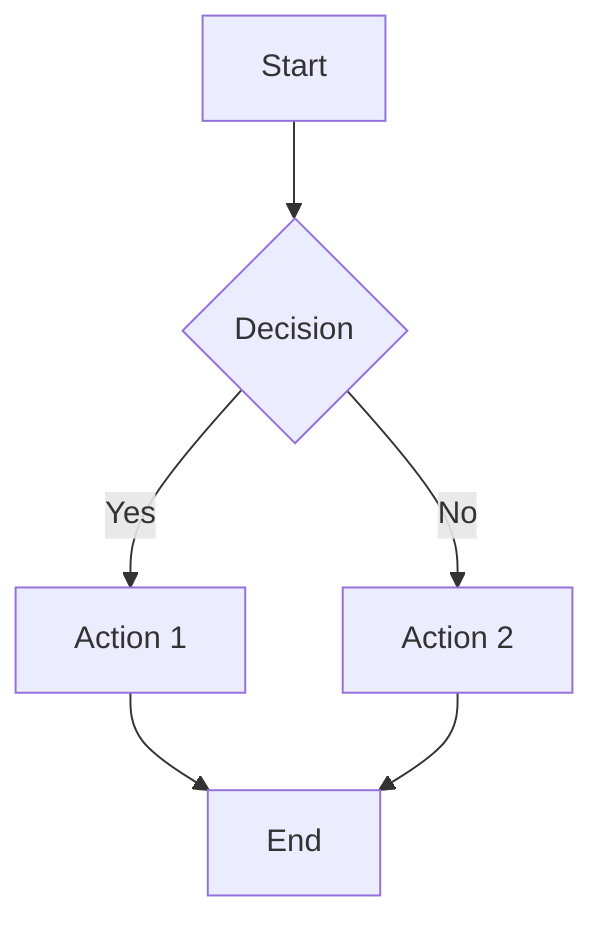

# Chapter Template

This is the template for all chapters in the Physical AI & Humanoid Robotics book.

## Learning Objectives

After completing this chapter, you should be able to:
- Understand the key concepts covered in this chapter
- Apply the techniques learned to practical scenarios
- Identify important considerations for implementation

## Content with Code Examples

This section contains the main content of the chapter with code examples.

```jsx
// Example code block with syntax highlighting
function exampleCode() {
  console.log("This is an example code block");
  return "Hello, Physical AI!";
}
```

## Mermaid Diagrams



## Callouts

:::info
This is an info callout. Use this to provide additional information that enhances the reader's understanding.
:::

:::tip
This is a tip callout. Use this to provide helpful suggestions or best practices.
:::

:::warning
This is a warning callout. Use this to alert readers about potential pitfalls or important considerations.
:::

## Exercises

1. Implement the example code in your own environment
2. Modify the example to explore different scenarios
3. Research related topics to deepen your understanding

## Key Takeaways

- Key point 1
- Key point 2
- Key point 3
