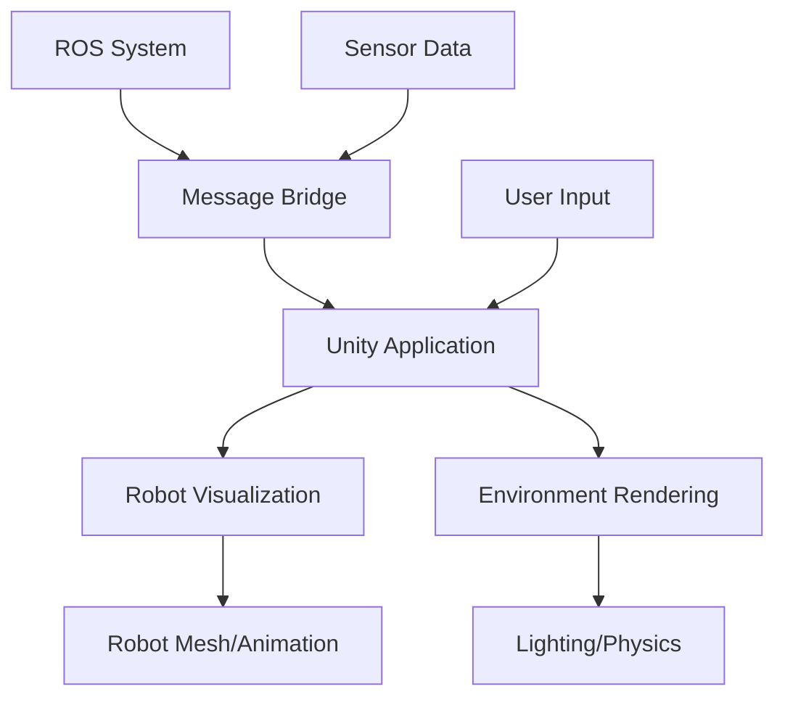

import Callout from '@site/src/components/Callout';

# Chapter 10: Unity Visualization

## Learning Objectives

After completing this chapter, you should be able to:
- Set up Unity for robotics visualization
- Import robot models and create realistic environments
- Integrate Unity with ROS for real-time visualization

## Content with Code Examples

Unity provides high-quality 3D visualization capabilities that can be used for robotics applications, from concept visualization to detailed simulation environments.

```csharp
using UnityEngine;
using System.Collections;

public class RobotController : MonoBehaviour
{
    public float moveSpeed = 5.0f;
    public float turnSpeed = 100.0f;
    
    void Update()
    {
        // Simple robot movement
        float vertical = Input.GetAxis("Vertical");
        float horizontal = Input.GetAxis("Horizontal");
        
        // Translate the robot forward/backward
        transform.Translate(Vector3.forward * Time.deltaTime * moveSpeed * vertical);
        
        // Rotate the robot left/right
        transform.Rotate(Vector3.up, turnSpeed * horizontal * Time.deltaTime);
    }
    
    void OnCollisionEnter(Collision collision)
    {
        // Handle collision with environment
        Debug.Log("Collision detected with: " + collision.gameObject.name);
    }
}
```

## Mermaid Diagrams



## Callouts

<Callout type="info">
Unity's high-quality rendering makes it ideal for creating realistic visualizations of robotic systems and environments for presentation or training purposes.
</Callout>

<Callout type="tip">
When creating robot models for Unity, optimize meshes and textures for real-time rendering performance while maintaining visual quality.
</Callout>

<Callout type="caution">
Unity is primarily focused on visualization. For physics simulation, consider using other tools and importing data to Unity for visualization only.
</Callout>

## Exercises

1. Create a Unity scene with a simple robot and environment
2. Implement ROS integration for real-time data visualization
3. Add user interaction controls for robot manipulation

## Key Takeaways

- Unity provides high-quality visualization for robotics applications
- Integration with ROS enables real-time data visualization
- Unity is best for visualization rather than physics simulation