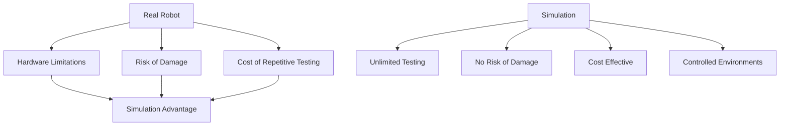

import Callout from '@site/src/components/Callout';

# Chapter 6: Introduction to Simulation Environments

## Learning Objectives

After completing this chapter, you should be able to:
- Understand the importance of simulation in robotics development
- Identify different types of simulation environments
- Evaluate when to use simulation vs. real-world testing

## Content with Code Examples

Simulation environments are crucial tools in robotics development, allowing developers to test algorithms, validate designs, and train AI models without the constraints and risks of real-world testing.

```python
# Example simulation environment setup
import numpy as np
import math

class SimulationEnvironment:
    def __init__(self, name, gravity=9.81, time_step=0.01):
        self.name = name
        self.gravity = gravity
        self.time_step = time_step
        self.objects = []
        self.lights = []
        self.cameras = []
        
    def add_object(self, obj):
        """Add an object to the simulation"""
        self.objects.append(obj)
        
    def step_simulation(self):
        """Advance the simulation by one time step"""
        for obj in self.objects:
            self.update_physics(obj)
            
    def update_physics(self, obj):
        """Update physics for a single object"""
        # Apply gravity
        obj.velocity[2] -= self.gravity * self.time_step
        
        # Update position based on velocity
        obj.position[0] += obj.velocity[0] * self.time_step
        obj.position[1] += obj.velocity[1] * self.time_step
        obj.position[2] += obj.velocity[2] * self.time_step
        
        # Handle collisions (simplified)
        if obj.position[2] < 0:  # Ground collision
            obj.position[2] = 0
            obj.velocity[2] = -obj.velocity[2] * obj.restitution  # Bounce with energy loss

# Example usage
class SimulatedRobot:
    def __init__(self, start_position):
        self.position = list(start_position)
        self.velocity = [0, 0, 0]
        self.restitution = 0.5  # Bounce factor
        self.sensors = []

def create_basic_environment():
    """Create a basic simulation environment"""
    env = SimulationEnvironment("Basic Testing Environment")
    
    # Add a robot to the environment
    robot = SimulatedRobot((0, 0, 1))  # Start 1m above ground
    env.add_object(robot)
    
    return env

# Run a simple simulation
env = create_basic_environment()
print(f"Starting simulation in {env.name}")

# Run for 100 time steps (1 second with 0.01 time step)
for i in range(100):
    env.step_simulation()
    robot = env.objects[0]  # Get the robot
    print(f"Step {i}: Position = ({robot.position[0]:.2f}, {robot.position[1]:.2f}, {robot.position[2]:.2f})")
```

## Mermaid Diagrams



## Callouts

<Callout type="info">
Simulation enables testing of edge cases and failure scenarios that would be dangerous or impossible to test on real robots.
</Callout>

<Callout type="tip">
Start with simple simulations and gradually increase complexity as your algorithms mature.
</Callout>

<Callout type="caution">
Remember the "reality gap" - behaviors that work in simulation might not work on real robots due to modeling inaccuracies.
</Callout>

## Exercises

1. Set up a basic simulation environment for a mobile robot
2. Compare the behavior of a simple controller in simulation vs. reality
3. Create multiple simulation scenarios with different environmental conditions

## Key Takeaways

- Simulation is essential for safe and cost-effective robotics development
- Different simulation tools offer varying levels of realism and performance
- Always validate simulation results on real hardware when possible