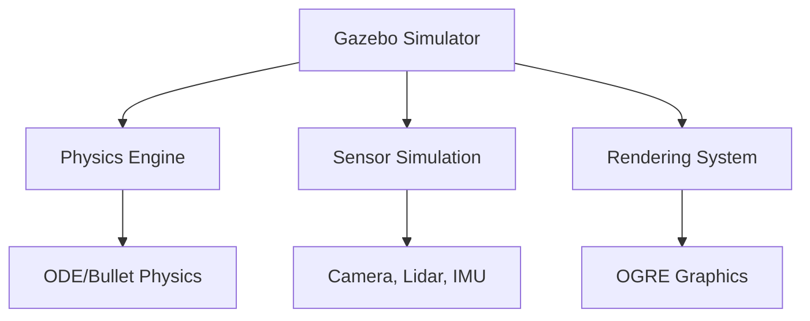

import Callout from '@site/src/components/Callout';

# Chapter 7: Gazebo Environment

## Learning Objectives

After completing this chapter, you should be able to:
- Set up and configure a Gazebo simulation environment
- Create custom worlds and models for simulation
- Configure sensors and plugins for realistic simulation

## Content with Code Examples

Gazebo is a robotics simulator that provides realistic physics simulation and rendering capabilities. It's an essential tool in robotics development for testing algorithms before deploying to real hardware.

```xml
<!-- Example SDF model for a simple robot -->
<sdf version="1.7">
  <model name="simple_robot">
    <pose>0 0 0.5 0 0 0</pose>
    <link name="chassis">
      <pose>0 0 0 0 0 0</pose>
      <collision name="collision">
        <geometry>
          <box>
            <size>1 1 0.5</size>
          </box>
        </geometry>
      </collision>
      <visual name="visual">
        <geometry>
          <box>
            <size>1 1 0.5</size>
          </box>
        </geometry>
      </visual>
      <inertial>
        <mass>1</mass>
        <inertia>
          <ixx>0.166667</ixx>
          <ixy>0</ixy>
          <ixz>0</ixz>
          <iyy>0.166667</iyy>
          <iyz>0</iyz>
          <izz>0.333333</izz>
        </inertia>
      </inertial>
    </link>
  </model>
</sdf>
```

## Mermaid Diagrams



## Callouts

<Callout type="info">
Gazebo provides realistic physics simulation using engines like ODE, Bullet, Simbody, and DART for accurate modeling of real-world physics.
</Callout>

<Callout type="tip">
When creating Gazebo models, focus on the parts that are important for your robot's function. You can use simplified models for simulation to improve performance.
</Callout>

<Callout type="caution">
Remember that simulation is never a perfect representation of reality. Always plan for differences when transitioning to real hardware.
</Callout>

## Exercises

1. Create a custom world file with obstacles and test robot navigation
2. Implement a sensor plugin for a custom sensor type
3. Experiment with different physics engine parameters to understand their impact on simulation

## Key Takeaways

- Gazebo provides realistic physics simulation for robotics development
- Creating accurate models and worlds is essential for meaningful simulation
- Sensor simulation allows for testing perception algorithms