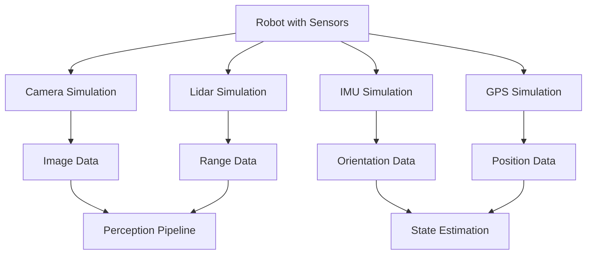

import Callout from '@site/src/components/Callout';

# Chapter 8: Sensor Simulation

## Learning Objectives

After completing this chapter, you should be able to:
- Configure various sensor types in simulation environments
- Understand the differences between simulated and real sensors
- Validate sensor data accuracy and noise models

## Content with Code Examples

Sensor simulation is critical for testing perception algorithms before deployment on real hardware. Simulated sensors produce data that mimics real sensors but with known ground truth.

```python
# Example sensor data validation
import numpy as np

def validate_camera_data(image_data):
    """Validate camera sensor data for expected ranges"""
    # Check image dimensions
    height, width, channels = image_data.shape
    assert height > 0 and width > 0, "Invalid image dimensions"
    
    # Check data type and range
    assert image_data.dtype == np.uint8, "Expected uint8 data type"
    assert np.max(image_data) <= 255 and np.min(image_data) >= 0, "Data out of range"
    
    return True

def add_noise_to_lidar(scan_data, noise_std=0.01):
    """Add realistic noise to simulated LiDAR data"""
    noise = np.random.normal(0, noise_std, size=scan_data.shape)
    noisy_scan = scan_data + noise
    # Ensure no negative distances
    noisy_scan = np.maximum(noisy_scan, 0.0)
    return noisy_scan
```

## Mermaid Diagrams



## Callouts

<Callout type="info">
Simulated sensors can provide ground truth data that's impossible or expensive to obtain with real sensors, enabling development of better algorithms.
</Callout>

<Callout type="tip">
When simulating sensors, include realistic noise models and sensor limitations to make the simulation as accurate as possible.
</Callout>

<Callout type="caution">
Sensor simulation can never perfectly replicate real-world conditions. Always test on real hardware before deployment.
</Callout>

## Exercises

1. Implement a noise model for a custom sensor type
2. Compare perception results from simulated vs. real sensor data
3. Evaluate how different noise parameters affect algorithm performance

## Key Takeaways

- Sensor simulation enables testing perception algorithms without real hardware
- Realistic noise models improve the validity of simulation results
- Ground truth data in simulation allows for more thorough algorithm validation