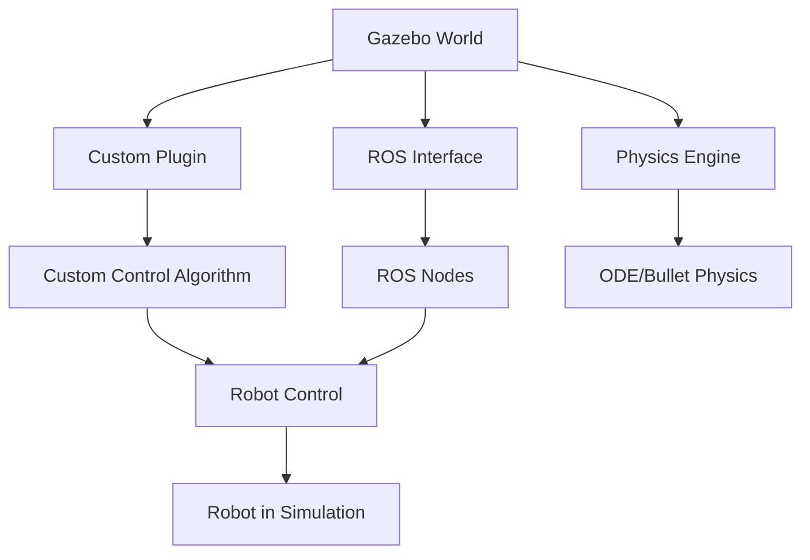

import Callout from '@site/src/components/Callout';

# Chapter 9: Advanced Gazebo

## Learning Objectives

After completing this chapter, you should be able to:
- Implement custom Gazebo plugins for specialized simulation needs
- Use Gazebo's ROS integration for robot control
- Optimize simulation performance for complex scenarios

## Content with Code Examples

Advanced Gazebo usage involves creating custom plugins that extend the simulator's capabilities for specific robot hardware or simulation scenarios.

```cpp
// Example Gazebo plugin for a custom actuator
#include <gazebo/gazebo.hh>
#include <gazebo/physics/physics.hh>
#include <gazebo/common/common.hh>

namespace gazebo
{
  class CustomActuatorPlugin : public ModelPlugin
  {
    public: void Load(physics::ModelPtr _parent, sdf::ElementPtr /*_sdf*/)
    {
      // Store the model pointer for later use
      this->model = _parent;
      
      // Listen to the update event. This event is broadcast every
      // simulation iteration.
      this->updateConnection = event::Events::ConnectWorldUpdateBegin(
          std::bind(&CustomActuatorPlugin::OnUpdate, this));
    }

    // Called by the world update start event
    public: void OnUpdate()
    {
      // Apply a force to the first link
      this->model->GetLink("link_name")->AddForce(math::Vector3(0, 0, 0.1));
    }

    // Pointer to the model
    private: physics::ModelPtr model;

    // Pointer to the update event connection
    private: event::ConnectionPtr updateConnection;
  };

  // Register this plugin with the simulator
  GZ_REGISTER_MODEL_PLUGIN(CustomActuatorPlugin)
}
```

## Mermaid Diagrams



## Callouts

<Callout type="info">
Gazebo plugins are compiled libraries that can modify the behavior of simulations, add new sensors, or implement custom physics.
</Callout>

<Callout type="tip">
Always test custom plugins in simple scenarios before applying them to complex simulations to ensure they behave as expected.
</Callout>

<Callout type="danger">
Incorrect plugin code can cause simulation instability or crashes. Thorough testing is essential.
</Callout>

## Exercises

1. Create a custom plugin for a specific sensor or actuator
2. Integrate a real-world control algorithm with Gazebo simulation
3. Optimize a complex simulation for better performance

## Key Takeaways

- Custom Gazebo plugins allow for specialized simulation capabilities
- Plugin development requires knowledge of Gazebo's API and C++
- Proper testing of plugins is crucial for simulation stability