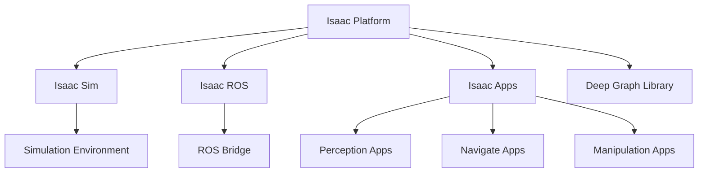

import Callout from '@site/src/components/Callout';

# Chapter 11: Isaac Platform Introduction

## Learning Objectives

After completing this chapter, you should be able to:
- Understand the Isaac platform ecosystem and components
- Set up Isaac Sim, Isaac ROS, and related tools
- Identify the advantages of the Isaac platform for robotics development

## Content with Code Examples

The NVIDIA Isaac platform provides a comprehensive set of tools for robotics development, including simulation, perception, navigation, and manipulation capabilities.

```python
# Example Isaac ROS message processing
import rclpy
from rclpy.node import Node
from sensor_msgs.msg import Image
from builtin_interfaces.msg import Time

class IsaacImageProcessor(Node):
    def __init__(self):
        super().__init__('isaac_image_processor')
        self.subscription = self.create_subscription(
            Image,
            'front_camera/image_raw',
            self.image_callback,
            10)
        self.subscription  # prevent unused variable warning

    def image_callback(self, msg: Image):
        # Process image data from Isaac Sim
        width = msg.width
        height = msg.height
        data = msg.data  # Raw image data
        
        self.get_logger().info(f'Received image: {width}x{height}')

def main(args=None):
    rclpy.init(args=args)
    image_processor = IsaacImageProcessor()
    rclpy.spin(image_processor)
    image_processor.destroy_node()
    rclpy.shutdown()

if __name__ == '__main__':
    main()
```

## Mermaid Diagrams



## Callouts

<Callout type="info">
The Isaac platform leverages NVIDIA's GPU computing capabilities for accelerated simulation and perception tasks, making it particularly powerful for AI-driven robotics.
</Callout>

<Callout type="tip">
Isaac Sim is built on NVIDIA Omniverse, which provides powerful rendering and simulation capabilities based on PhysX physics engine.
</Callout>

<Callout type="caution">
The Isaac platform requires NVIDIA GPUs for full functionality, particularly for accelerated perception and rendering tasks.
</Callout>

## Exercises

1. Install Isaac Sim and run a basic simulation scenario
2. Explore the Isaac examples and sample applications
3. Integrate a simple robot model with Isaac Sim

## Key Takeaways

- The Isaac platform provides a complete toolchain for AI-powered robotics
- Integration with NVIDIA's GPU technology enables accelerated computing
- Isaac bridges simulation and real-world robotics applications