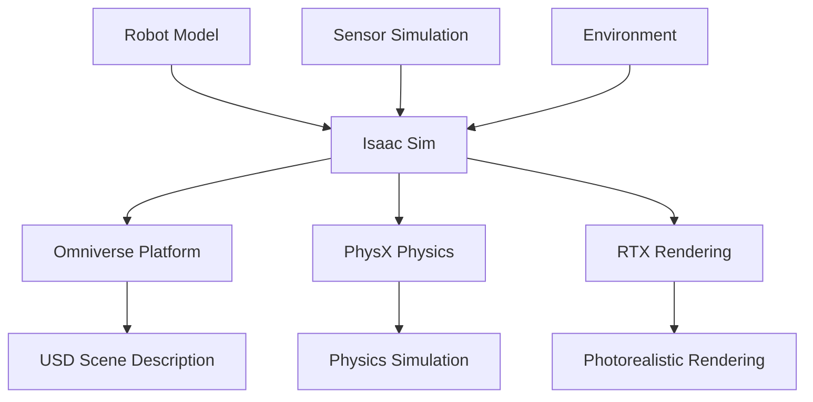

import Callout from '@site/src/components/Callout';

# Chapter 12: Isaac Sim

## Learning Objectives

After completing this chapter, you should be able to:
- Set up and configure Isaac Sim for robot simulation
- Create and customize simulation environments
- Leverage Isaac Sim's photorealistic rendering capabilities

## Content with Code Examples

Isaac Sim is NVIDIA's robotics simulation application based on the Omniverse platform, providing high-fidelity physics simulation and photorealistic rendering.

```python
# Example Isaac Sim configuration
import omni
from omni.isaac.core import World
from omni.isaac.core.utils.stage import add_reference_to_stage
from omni.isaac.core.utils.nucleus import find_nucleus_server

# Initialize the world
my_world = World(stage_units_in_meters=1.0)

# Add a robot to the stage
add_reference_to_stage(
    usd_path="path/to/robot.usd",
    prim_path="/World/Robot"
)

# Add a ground plane
my_world.scene.add_default_ground_plane()

# Simulate for 100 steps
for i in range(100):
    my_world.step(render=True)
```

## Mermaid Diagrams



## Callouts

<Callout type="info">
Isaac Sim uses USD (Universal Scene Description) for scene representation, making it compatible with other Omniverse applications and industry-standard tools.
</Callout>

<Callout type="tip">
Use Isaac Sim's synthetic data generation capabilities to create large datasets for training AI models with ground truth annotations.
</Callout>

<Callout type="caution">
Isaac Sim requires NVIDIA RTX-capable GPUs for optimal rendering performance and advanced simulation features.
</Callout>

## Exercises

1. Set up a simple robot simulation environment in Isaac Sim
2. Configure sensor simulation for a robot in Isaac Sim
3. Generate synthetic data using Isaac Sim's capabilities

## Key Takeaways

- Isaac Sim provides high-fidelity simulation with photorealistic rendering
- Based on NVIDIA Omniverse and USD for compatibility with industry tools
- Enables synthetic data generation for AI training