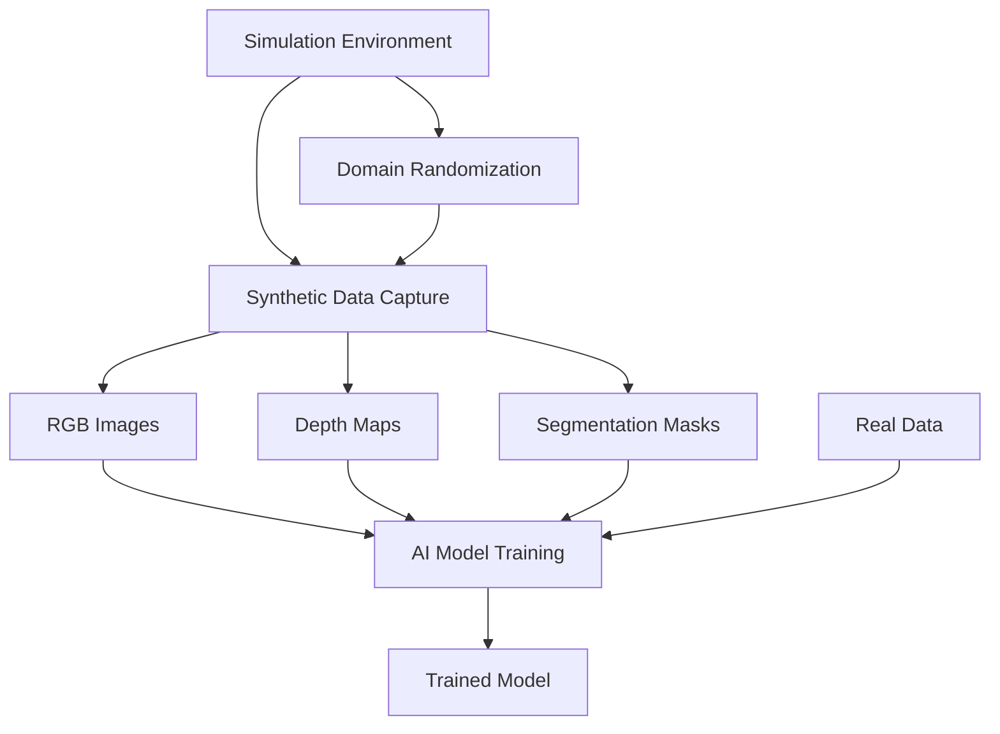

import Callout from '@site/src/components/Callout';

# Chapter 13: Synthetic Data Generation

## Learning Objectives

After completing this chapter, you should be able to:
- Understand the importance of synthetic data in robotics AI
- Generate photorealistic synthetic data using Isaac Sim
- Evaluate the quality and applicability of synthetic data for training

## Content with Code Examples

Synthetic data generation is a powerful technique that leverages simulation environments to create large, diverse, and annotated datasets for training AI models.

```python
# Example synthetic data generation pipeline
import numpy as np
import cv2
from omni.isaac.core import World
from omni.isaac.synthetic_utils import SyntheticDataHelper

def generate_synthetic_dataset(world: World, num_samples: int):
    """Generate a synthetic dataset with annotations"""
    sd_helper = SyntheticDataHelper()
    
    images = []
    depth_maps = []
    segmentations = []
    
    for i in range(num_samples):
        # Step the simulation
        world.step(render=True)
        
        # Capture RGB data
        rgb_data = sd_helper.get_rgb_data()
        
        # Capture depth data
        depth_data = sd_helper.get_depth_data()
        
        # Capture segmentation data
        seg_data = sd_helper.get_segmentation_data()
        
        # Store the data
        images.append(rgb_data)
        depth_maps.append(depth_data)
        segmentations.append(seg_data)
        
        # Change environment slightly for diversity
        # (change lighting, object positions, etc.)
    
    return images, depth_maps, segmentations

def augment_synthetic_data(images, depth_maps):
    """Apply domain randomization to synthetic data"""
    augmented_images = []
    augmented_depths = []
    
    for img, depth in zip(images, depth_maps):
        # Apply random lighting conditions
        brightness_factor = np.random.uniform(0.5, 1.5)
        augmented_img = np.clip(img * brightness_factor, 0, 255)
        
        # Apply random blurring
        if np.random.random() > 0.5:
            kernel_size = np.random.choice([3, 5, 7])
            augmented_img = cv2.GaussianBlur(augmented_img, (kernel_size, kernel_size), 0)
        
        augmented_images.append(augmented_img)
        augmented_depths.append(depth)
    
    return augmented_images, augmented_depths
```

## Mermaid Diagrams



## Callouts

<Callout type="info">
Synthetic data generation can provide unlimited, perfectly annotated data with diverse scenarios that would be expensive or impossible to capture in real life.
</Callout>

<Callout type="tip">
Apply domain randomization techniques to synthetic data to improve the transferability of models trained on synthetic data to real-world scenarios.
</Callout>

<Callout type="caution">
While synthetic data is valuable, it may not perfectly represent real-world conditions. Always validate models on real data when possible.
</Callout>

## Exercises

1. Generate a synthetic dataset for object detection using Isaac Sim
2. Apply domain randomization to improve synthetic data diversity
3. Compare model performance trained on synthetic vs. real data

## Key Takeaways

- Synthetic data generation provides annotated datasets at scale
- Domain randomization helps bridge the sim-to-real gap
- Synthetic data complements but doesn't fully replace real-world data