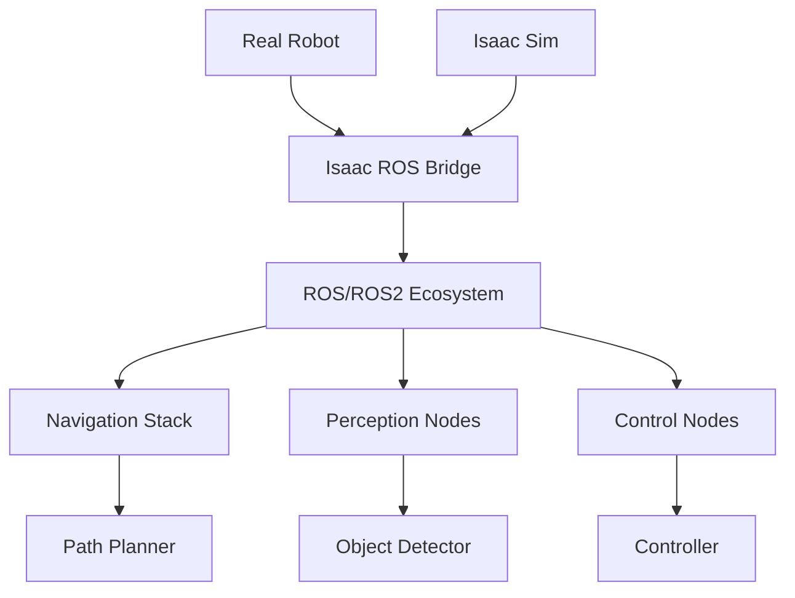

import Callout from '@site/src/components/Callout';

# Chapter 14: Isaac ROS Integration

## Learning Objectives

After completing this chapter, you should be able to:
- Integrate Isaac Sim with ROS/ROS2 for robot control
- Use Isaac ROS packages for perception and navigation
- Implement real-to-sim and sim-to-real workflows

## Content with Code Examples

Isaac ROS provides a bridge between NVIDIA's Isaac platform and the Robot Operating System, enabling developers to leverage both ecosystems.

```xml
<!-- Example launch file for Isaac ROS bridge -->
<launch>
  <!-- Start Isaac Sim -->
  <node name="isaac_sim" pkg="isaac_sim" type="isaac_sim_node" output="screen">
    <param name="config_file" value="$(find my_robot_isaac)/config/robot_config.yaml"/>
  </node>
  
  <!-- Start ROS bridge -->
  <node name="ros_bridge" pkg="omni.isaac.ros_bridge" type="ros_bridge_node" output="screen">
    <param name="publish_frequency" value="30"/>
  </node>
  
  <!-- Start robot controller -->
  <node name="robot_controller" pkg="my_robot_control" type="controller_node" output="screen">
    <param name="control_rate" value="100"/>
  </node>
</launch>
```

```python
# Example Isaac ROS node
import rclpy
from rclpy.node import Node
from sensor_msgs.msg import Image, CameraInfo
from geometry_msgs.msg import Twist
from cv_bridge import CvBridge
import numpy as np

class IsaacROSController(Node):
    def __init__(self):
        super().__init__('isaac_ros_controller')
        
        # Initialize CvBridge for image conversion
        self.bridge = CvBridge()
        
        # Create subscribers for Isaac Sim sensors
        self.image_sub = self.create_subscription(
            Image,
            '/front_camera/image_raw',
            self.image_callback,
            10)
        
        self.camera_info_sub = self.create_subscription(
            CameraInfo,
            '/front_camera/camera_info',
            self.camera_info_callback,
            10)
        
        # Create publisher for robot control
        self.cmd_vel_pub = self.create_publisher(Twist, '/cmd_vel', 10)
        
        # Timer for control loop
        self.timer = self.create_timer(0.1, self.control_loop)
        
        # Internal state
        self.latest_image = None
        self.camera_info = None
        self.obstacle_detected = False

    def image_callback(self, msg: Image):
        """Process images from Isaac Sim"""
        try:
            # Convert ROS Image to OpenCV
            cv_image = self.bridge.imgmsg_to_cv2(msg, desired_encoding='bgr8')
            
            # Simple obstacle detection (in a real application, this would be more sophisticated)
            gray = cv2.cvtColor(cv_image, cv2.COLOR_BGR2GRAY)
            height, width = gray.shape
            
            # Check the center region for obstacles (using intensity as a proxy)
            center_region = gray[int(height*0.4):int(height*0.6), int(width*0.4):int(width*0.6)]
            avg_intensity = np.mean(center_region)
            
            self.obstacle_detected = avg_intensity < 50  # Adjust threshold as needed
            self.latest_image = cv_image
            
        except Exception as e:
            self.get_logger().error(f'Error processing image: {e}')

    def camera_info_callback(self, msg: CameraInfo):
        """Store camera calibration parameters"""
        self.camera_info = msg

    def control_loop(self):
        """Main control loop"""
        msg = Twist()
        
        if self.obstacle_detected:
            # Stop if obstacle detected
            msg.linear.x = 0.0
            msg.angular.z = 0.5  # Turn to avoid obstacle
        else:
            # Move forward otherwise
            msg.linear.x = 0.5
            msg.angular.z = 0.0
        
        self.cmd_vel_pub.publish(msg)

def main(args=None):
    rclpy.init(args=args)
    controller = IsaacROSController()
    
    try:
        rclpy.spin(controller)
    except KeyboardInterrupt:
        pass
    finally:
        controller.destroy_node()
        rclpy.shutdown()

if __name__ == '__main__':
    main()
```

## Mermaid Diagrams



## Callouts

<Callout type="info">
Isaac ROS packages provide GPU-accelerated perception algorithms that can significantly outperform CPU-only implementations in ROS.
</Callout>

<Callout type="tip">
Use Isaac Sim to develop and test ROS nodes before deploying to real hardware, reducing development time and risk.
</Callout>

<Callout type="caution">
Performance characteristics in simulation may differ from real hardware. Always validate on real robots before deployment.
</Callout>

## Exercises

1. Set up Isaac Sim with ROS bridge for a robot model
2. Implement a simple navigation stack using Isaac ROS packages
3. Test robot control in simulation before real-world deployment

## Key Takeaways

- Isaac ROS enables integration between Isaac platform and ROS/ROS2
- GPU-accelerated perception algorithms improve performance
- Simulation helps develop and test ROS nodes safely