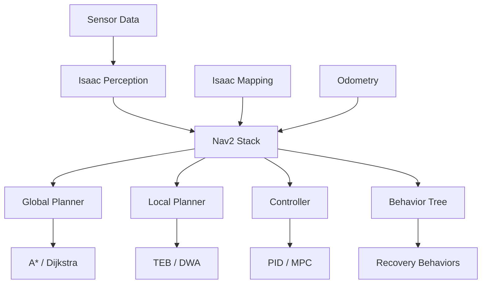

import Callout from '@site/src/components/Callout';

# Chapter 15: Navigation 2 (Nav2) with Isaac

## Learning Objectives

After completing this chapter, you should be able to:
- Configure Nav2 for simulation and real-world deployment
- Integrate Nav2 with Isaac platform for enhanced navigation
- Optimize navigation parameters for different environments

## Content with Code Examples

Navigation 2 (Nav2) is the navigation stack for ROS 2, providing path planning, path execution, and obstacle avoidance capabilities for mobile robots.

```yaml
# Example Nav2 configuration file (nav2_params.yaml)
amcl:
  ros__parameters:
    use_sim_time: True
    alpha1: 0.2
    alpha2: 0.2
    alpha3: 0.2
    alpha4: 0.2
    alpha5: 0.2
    base_frame_id: "base_footprint"
    beam_skip_distance: 0.5
    beam_skip_error_threshold: 0.9
    beam_skip_threshold: 0.3
    do_beamskip: false
    global_frame_id: "map"
    lambda_short: 0.1
    laser_likelihood_max_dist: 2.0
    max_beams: 60
    max_particles: 2000
    min_particles: 500
    odom_frame_id: "odom"
    pf_err: 0.05
    pf_z: 0.99
    recovery_alpha_fast: 0.0
    recovery_alpha_slow: 0.0
    resolution: 0.05
    robot_model_type: "nav2_amcl::DifferentialMotionModel"
    save_pose_rate: 0.5
    sigma_hit: 0.2
    tf_broadcast: true
    transform_timeout: 1.0
    update_min_a: 0.2
    update_min_d: 0.2
    z_hit: 0.5
    z_max: 0.05
    z_rand: 0.5
    z_short: 0.05

bt_navigator:
  ros__parameters:
    use_sim_time: True
    global_frame: map
    robot_base_frame: base_link
    odom_topic: /odom
    bt_loop_duration: 10
    default_server_timeout: 20
    # Specify the path where the BT XML files are located
    plugin_lib_names:
    - nav2_compute_path_to_pose_action_bt_node
    - nav2_compute_path_through_poses_action_bt_node
    - nav2_follow_path_action_bt_node
    - nav2_spin_action_bt_node
    - nav2_wait_action_bt_node
    - nav2_back_up_action_bt_node
    - nav2_drive_on_heading_bt_node
    - nav2_clear_costmap_service_bt_node
    - nav2_is_stuck_condition_bt_node
    - nav2_have_remaining_waypoints_condition_bt_node
    - nav2_is_path_valid_condition_bt_node
    - nav2_initial_pose_received_condition_bt_node
    - nav2_reinitialize_global_localization_service_bt_node
    - nav2_rate_controller_bt_node
    - nav2_distance_controller_bt_node
    - nav2_speed_controller_bt_node
    - nav2_truncate_path_action_bt_node
    - nav2_goal_updater_node_bt_node
    - nav2_recovery_node_bt_node
    - nav2_pipeline_sequence_bt_node
    - nav2_round_robin_node_bt_node
    - nav2_transform_available_condition_bt_node
    - nav2_time_expired_condition_bt_node
    - nav2_path_expiring_timer_condition
    - nav2_distance_traveled_condition_bt_node
```

```python
# Example Nav2 behavior tree customization for Isaac
import rclpy
from rclpy.action import ActionClient
from rclpy.node import Node
from nav2_msgs.action import NavigateToPose
from geometry_msgs.msg import PoseStamped
from std_msgs.msg import String
import math

class IsaacNav2Controller(Node):
    def __init__(self):
        super().__init__('isaac_nav2_controller')
        
        # Create action client for navigation
        self.nav_to_pose_client = ActionClient(
            self, 
            NavigateToPose, 
            'navigate_to_pose'
        )
        
        # Publisher for status
        self.status_pub = self.create_publisher(String, 'nav_status', 10)
        
        # Timer to send navigation goals
        self.timer = self.create_timer(10.0, self.send_navigation_goal)
        
        # Waypoints to navigate to
        self.waypoints = [
            [2.0, 0.0, 0.0],  # x, y, theta
            [2.0, 2.0, 1.57], 
            [0.0, 2.0, 3.14],
            [0.0, 0.0, 0.0]   # Return to start
        ]
        self.current_waypoint = 0

    def send_navigation_goal(self):
        """Send a navigation goal to Nav2"""
        if not self.nav_to_pose_client.wait_for_server(timeout_sec=1.0):
            self.get_logger().error('Navigation action server not available')
            return

        goal_msg = NavigateToPose.Goal()
        goal_msg.pose = PoseStamped()
        goal_msg.pose.header.frame_id = 'map'
        goal_msg.pose.header.stamp = self.get_clock().now().to_msg()
        
        # Set the target pose
        waypoint = self.waypoints[self.current_waypoint]
        goal_msg.pose.pose.position.x = waypoint[0]
        goal_msg.pose.pose.position.y = waypoint[1]
        goal_msg.pose.pose.position.z = 0.0
        
        # Convert theta to quaternion
        theta = waypoint[2]
        goal_msg.pose.pose.orientation.z = math.sin(theta / 2.0)
        goal_msg.pose.pose.orientation.w = math.cos(theta / 2.0)

        # Send the goal
        self.nav_to_pose_client.send_goal_async(
            goal_msg,
            feedback_callback=self.feedback_callback
        ).add_done_callback(self.goal_response_callback)
        
        self.get_logger().info(f'Sent navigation goal to waypoint {self.current_waypoint}: {waypoint}')
        
        # Update waypoint index
        self.current_waypoint = (self.current_waypoint + 1) % len(self.waypoints)

    def goal_response_callback(self, future):
        """Handle response from navigation server"""
        goal_handle = future.result()
        if not goal_handle.accepted:
            self.get_logger().info('Navigation goal rejected')
            return

        self.get_logger().info('Navigation goal accepted')
        result_future = goal_handle.get_result_async()
        result_future.add_done_callback(self.get_result_callback)

    def get_result_callback(self, future):
        """Handle navigation result"""
        result = future.result().result
        self.get_logger().info(f'Navigation result: {result}')

    def feedback_callback(self, feedback_msg):
        """Handle navigation feedback"""
        feedback = feedback_msg.feedback
        # Publish navigation status
        status_msg = String()
        status_msg.data = f'Navigating: {feedback.current_pose.pose.position.x:.2f}, {feedback.current_pose.pose.position.y:.2f}'
        self.status_pub.publish(status_msg)

def main(args=None):
    rclpy.init(args=args)
    controller = IsaacNav2Controller()
    
    try:
        rclpy.spin(controller)
    except KeyboardInterrupt:
        pass
    finally:
        controller.destroy_node()
        rclpy.shutdown()

if __name__ == '__main__':
    main()
```

## Mermaid Diagrams



## Callouts

<Callout type="info">
Nav2 uses behavior trees to implement complex navigation behaviors, allowing for flexible and robust navigation strategies.
</Callout>

<Callout type="tip">
When using Nav2 with Isaac, leverage Isaac's sensor simulation and mapping capabilities to create realistic test scenarios.
</Callout>

<Callout type="caution">
Navigation parameters need to be tuned for specific robots and environments. Start with simulation before applying to real robots.
</Callout>

## Exercises

1. Configure Nav2 for a robot in Isaac Sim environment
2. Implement custom behavior tree nodes for specific navigation tasks
3. Tune navigation parameters for different types of environments

## Key Takeaways

- Nav2 provides comprehensive navigation capabilities for ROS 2
- Behavior trees enable complex navigation behaviors
- Integration with Isaac enhances simulation and testing