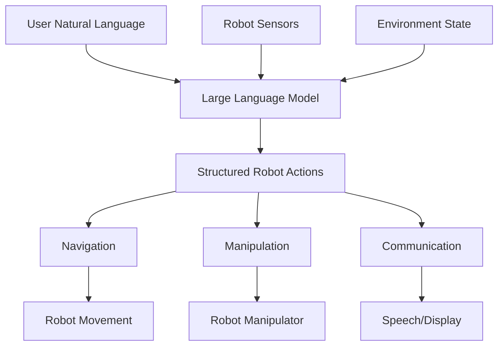

import Callout from '@site/src/components/Callout';

# Chapter 16: Large Language Models and Robotics

## Learning Objectives

After completing this chapter, you should be able to:
- Understand how large language models (LLMs) can be integrated with robotics systems
- Implement natural language interfaces for robot control
- Evaluate the benefits and challenges of LLM-robot integration

## Content with Code Examples

Large Language Models (LLMs) like GPT, Claude, and specialized models are increasingly being integrated with robotics systems to enable natural language interaction, task planning, and high-level reasoning.

```python
import openai
import rclpy
from rclpy.action import ActionClient
from rclpy.node import Node
from geometry_msgs.msg import PoseStamped
from std_msgs.msg import String
import json

class LLMRobotController(Node):
    def __init__(self):
        super().__init__('llm_robot_controller')
        
        # Set OpenAI API key (in a real application, this would be in a secure config)
        openai.api_key = "YOUR_API_KEY"
        
        # Create publishers and subscribers
        self.nav_goal_pub = self.create_publisher(PoseStamped, '/goal_pose', 10)
        self.cmd_pub = self.create_publisher(String, '/robot_command', 10)
        self.voice_sub = self.create_subscription(
            String, 
            '/voice_command', 
            self.voice_command_callback, 
            10
        )
        
        # Timer to process high-level commands
        self.timer = self.create_timer(1.0, self.process_commands)

        self.pending_commands = []

    def voice_command_callback(self, msg: String):
        """Handle incoming voice commands"""
        command_text = msg.data
        self.get_logger().info(f'Received voice command: {command_text}')
        
        # Process command through LLM to generate robot actions
        robot_action = self.process_command_with_llm(command_text)
        self.pending_commands.append(robot_action)

    def process_command_with_llm(self, command: str) -> dict:
        """Process natural language command using LLM"""
        prompt = f"""
        Given the following robot command, convert it into structured robot actions.
        The robot capabilities are: navigation, object manipulation, grasping, speaking, and light control.
        Respond in JSON format with action_type and parameters.
        
        Command: "{command}"
        
        Example response structure:
        {{
            "action_type": "navigation",
            "parameters": {{
                "destination": [x, y, theta]
            }}
        }}
        
        Response:
        """
        
        try:
            response = openai.ChatCompletion.create(
                model="gpt-3.5-turbo",
                messages=[{"role": "user", "content": prompt}],
                temperature=0.1
            )
            
            # Parse the LLM response
            action_str = response.choices[0].message['content'].strip()
            
            # Extract JSON from response (in a real implementation, this would be more robust)
            start_idx = action_str.find('{')
            end_idx = action_str.rfind('}') + 1
            json_str = action_str[start_idx:end_idx]
            
            return json.loads(json_str)
        except Exception as e:
            self.get_logger().error(f'Error processing command with LLM: {e}')
            return {"action_type": "error", "parameters": {}}

    def process_commands(self):
        """Process pending commands"""
        if not self.pending_commands:
            return
            
        command = self.pending_commands.pop(0)
        
        if command["action_type"] == "navigation":
            self.execute_navigation(command["parameters"])
        elif command["action_type"] == "manipulation":
            self.execute_manipulation(command["parameters"])
        elif command["action_type"] == "speak":
            self.execute_speak(command["parameters"])

    def execute_navigation(self, params):
        """Execute navigation command"""
        pose_msg = PoseStamped()
        pose_msg.header.stamp = self.get_clock().now().to_msg()
        pose_msg.header.frame_id = 'map'
        
        dest = params.get("destination", [0, 0, 0])
        pose_msg.pose.position.x = float(dest[0])
        pose_msg.pose.position.y = float(dest[1])
        pose_msg.pose.position.z = 0.0
        
        # Convert theta to quaternion
        theta = dest[2]
        pose_msg.pose.orientation.z = math.sin(theta / 2.0)
        pose_msg.pose.orientation.w = math.cos(theta / 2.0)
        
        self.nav_goal_pub.publish(pose_msg)
        self.get_logger().info(f'Navigating to: {dest}')

def main(args=None):
    rclpy.init(args=args)
    controller = LLMRobotController()
    
    try:
        rclpy.spin(controller)
    except KeyboardInterrupt:
        pass
    finally:
        controller.destroy_node()
        rclpy.shutdown()

if __name__ == '__main__':
    main()
```

## Mermaid Diagrams



## Callouts

<Callout type="info">
LLMs can bridge the gap between high-level human instructions and low-level robot actions, enabling more intuitive human-robot interaction.
</Callout>

<Callout type="tip">
When using LLMs with robots, implement safety checks to ensure that generated actions are appropriate and safe for the environment.
</Callout>

<Callout type="caution">
LLMs can generate plausible but incorrect responses. Always validate and verify commands before execution on physical robots.
</Callout>

## Exercises

1. Implement a natural language interface for a simulated robot
2. Create a safety validation system for LLM-generated commands
3. Evaluate the effectiveness of LLM-based task planning vs. traditional methods

## Key Takeaways

- LLMs enable natural language interaction with robots
- They can generate complex action sequences from high-level commands
- Safety validation is critical when executing LLM-generated commands