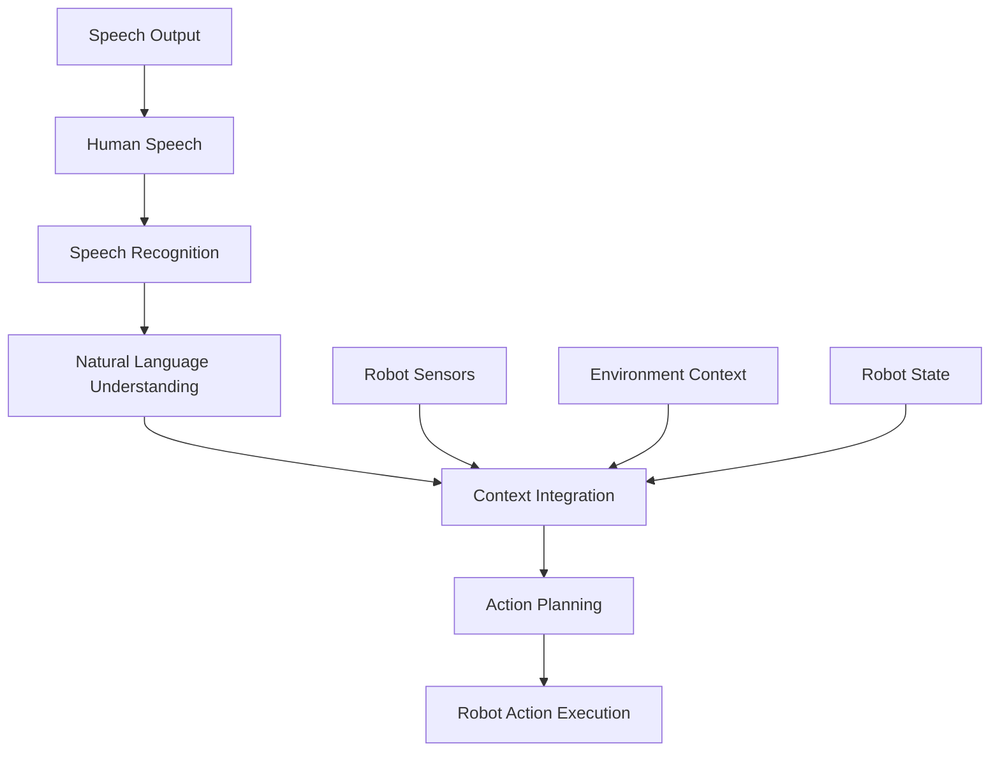

import Callout from '@site/src/components/Callout';

# Chapter 17: Voice to Action Systems

## Learning Objectives

After completing this chapter, you should be able to:
- Build voice-to-action systems for robotics applications
- Integrate speech recognition with robot control
- Implement context-aware voice command interpretation

## Content with Code Examples

Voice to action systems enable robots to understand and execute spoken commands, providing a natural interface for human-robot interaction.

```python
import speech_recognition as sr
import rclpy
from rclpy.node import Node
from std_msgs.msg import String
from geometry_msgs.msg import Twist
from sensor_msgs.msg import LaserScan
import time

class VoiceToActionNode(Node):
    def __init__(self):
        super().__init__('voice_to_action')
        
        # Initialize speech recognizer
        self.recognizer = sr.Recognizer()
        self.microphone = sr.Microphone()
        
        # Set up ROS publishers
        self.cmd_vel_pub = self.create_publisher(Twist, '/cmd_vel', 10)
        self.speech_pub = self.create_publisher(String, '/tts_input', 10)
        
        # Subscribe to sensor data for context awareness
        self.lidar_sub = self.create_subscription(
            LaserScan, 
            '/scan', 
            self.lidar_callback, 
            10
        )
        
        # Robot state
        self.lidar_data = None
        self.last_command_time = time.time()
        
        # Start voice recognition
        self.get_logger().info('Starting voice recognition...')
        self.listen_for_commands()

    def lidar_callback(self, msg: LaserScan):
        """Update lidar data for context awareness"""
        self.lidar_data = msg.ranges

    def listen_for_commands(self):
        """Continuously listen for voice commands"""
        with self.microphone as source:
            self.recognizer.adjust_for_ambient_noise(source)
        
        self.get_logger().info('Listening for commands...')
        
        while rclpy.ok():
            try:
                with self.microphone as source:
                    # Listen for audio with timeout
                    audio = self.recognizer.listen(source, timeout=5.0, phrase_time_limit=5.0)
                
                # Recognize speech using Google Web Speech API
                command_text = self.recognizer.recognize_google(audio).lower()
                self.get_logger().info(f'Heard command: {command_text}')
                
                # Process the command
                self.process_voice_command(command_text)
                
            except sr.WaitTimeoutError:
                # No speech detected within timeout, continue listening
                pass
            except sr.UnknownValueError:
                self.get_logger().info('Could not understand audio')
            except sr.RequestError as e:
                self.get_logger().error(f'Error with speech recognition service: {e}')
            except Exception as e:
                self.get_logger().error(f'Unexpected error: {e}')

    def process_voice_command(self, command: str):
        """Process recognized voice command"""
        # Context-aware processing
        if 'stop' in command:
            self.stop_robot()
        elif 'forward' in command or 'go' in command:
            if self.is_path_clear():
                self.move_forward()
            else:
                self.say("Path is blocked, cannot move forward")
        elif 'backward' in command:
            self.move_backward()
        elif 'turn left' in command or 'left' in command:
            self.turn_left()
        elif 'turn right' in command or 'right' in command:
            self.turn_right()
        elif 'spin' in command:
            self.spin()
        elif 'help' in command:
            self.provide_help()
        else:
            self.say(f"I didn't understand the command: {command}")
        
        self.last_command_time = time.time()

    def is_path_clear(self) -> bool:
        """Check if path ahead is clear using lidar data"""
        if self.lidar_data is None:
            return True  # If no data available, assume path is clear
        
        # Check the front 30-degree sector
        front_ranges = self.lidar_data[len(self.lidar_data)//2 - 15 : len(self.lidar_data)//2 + 15]
        min_distance = min([r for r in front_ranges if r != float('inf')], default=float('inf'))
        
        # Path is clear if no obstacles within 1 meter
        return min_distance > 1.0

    def stop_robot(self):
        """Stop the robot"""
        cmd = Twist()
        cmd.linear.x = 0.0
        cmd.angular.z = 0.0
        self.cmd_vel_pub.publish(cmd)
        self.say("Stopping robot")

    def move_forward(self):
        """Move robot forward"""
        cmd = Twist()
        cmd.linear.x = 0.5  # m/s
        cmd.angular.z = 0.0
        self.cmd_vel_pub.publish(cmd)
        self.say("Moving forward")

    def move_backward(self):
        """Move robot backward"""
        cmd = Twist()
        cmd.linear.x = -0.5  # m/s
        cmd.angular.z = 0.0
        self.cmd_vel_pub.publish(cmd)
        self.say("Moving backward")

    def turn_left(self):
        """Turn robot left"""
        cmd = Twist()
        cmd.linear.x = 0.0
        cmd.angular.z = 0.5  # rad/s
        self.cmd_vel_pub.publish(cmd)
        self.say("Turning left")

    def turn_right(self):
        """Turn robot right"""
        cmd = Twist()
        cmd.linear.x = 0.0
        cmd.angular.z = -0.5  # rad/s
        self.cmd_vel_pub.publish(cmd)
        self.say("Turning right")

    def spin(self):
        """Spin robot in place"""
        cmd = Twist()
        cmd.linear.x = 0.0
        cmd.angular.z = 1.0  # rad/s
        self.cmd_vel_pub.publish(cmd)
        self.say("Spinning")

    def say(self, text: str):
        """Publish text for TTS system"""
        msg = String()
        msg.data = text
        self.speech_pub.publish(msg)
        self.get_logger().info(f"Robot says: {text}")

    def provide_help(self):
        """Provide help on available commands"""
        help_text = "Available commands: move forward, turn left, turn right, spin, stop, help"
        self.say(help_text)

def main(args=None):
    rclpy.init(args=args)
    
    # Set up speech recognition parameters
    recognizer = sr.Recognizer()
    recognizer.energy_threshold = 4000  # Adjust for ambient noise
    
    try:
        voice_node = VoiceToActionNode()
        rclpy.spin(voice_node)
    except KeyboardInterrupt:
        pass
    finally:
        voice_node.destroy_node()
        rclpy.shutdown()

if __name__ == '__main__':
    main()
```

## Mermaid Diagrams



## Callouts

<Callout type="info">
Context-aware voice systems consider sensor data and robot state when interpreting commands, making them more robust and useful.
</Callout>

<Callout type="tip">
Implement timeouts and error handling in voice recognition systems to prevent the robot from getting stuck waiting for commands.
</Callout>

<Callout type="caution">
Voice recognition accuracy can vary with ambient noise, accents, and other factors. Always provide feedback to users about recognized commands.
</Callout>

## Exercises

1. Build a voice-controlled robot in simulation with safety constraints
2. Implement context-awareness based on sensor data for voice commands
3. Evaluate voice recognition performance in different acoustic environments

## Key Takeaways

- Voice-to-action systems provide intuitive human-robot interaction
- Context awareness improves reliability of voice commands
- Proper error handling is essential for usable systems