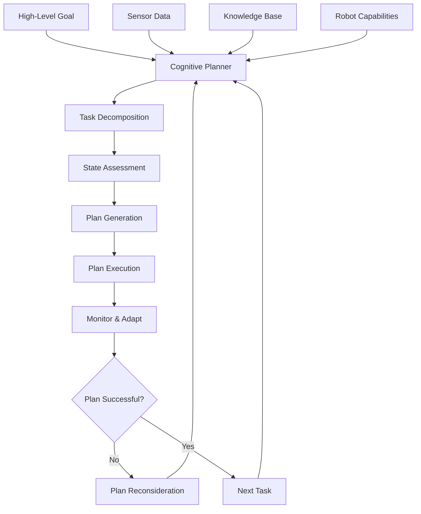

import Callout from '@site/src/components/Callout';

# Chapter 18: Cognitive Planning for Robotics

## Learning Objectives

After completing this chapter, you should be able to:
- Understand cognitive planning approaches in robotics
- Implement planning systems that integrate knowledge and perception
- Design planning systems that can adapt to changing environments

## Content with Code Examples

Cognitive planning in robotics involves creating systems that can reason about complex tasks, integrate knowledge from various sources, and adapt their plans based on changing conditions.

```python
from enum import Enum
from dataclasses import dataclass
from typing import List, Dict, Optional
import rclpy
from rclpy.node import Node
from geometry_msgs.msg import PoseStamped
from std_msgs.msg import String
from sensor_msgs.msg import Image
import json

class TaskType(Enum):
    NAVIGATE = "navigate"
    MANIPULATE = "manipulate"
    PERCEIVE = "perceive"
    COMMUNICATE = "communicate"

class ObjectState(Enum):
    UNKNOWN = "unknown"
    PRESENT = "present"
    ABSENT = "absent"
    GRASPED = "grasped"

@dataclass
class RobotState:
    position: tuple  # (x, y, theta)
    battery_level: float
    objects: Dict[str, ObjectState]
    last_perception_time: float

@dataclass
class Task:
    task_type: TaskType
    target: str
    parameters: Dict = None
    priority: int = 1

class CognitivePlanner(Node):
    def __init__(self):
        super().__init__('cognitive_planner')
        
        # Initialize robot state
        self.robot_state = RobotState(
            position=(0, 0, 0),
            battery_level=1.0,
            objects={},
            last_perception_time=0
        )
        
        # Initialize task queue
        self.task_queue: List[Task] = []
        
        # Publishers
        self.nav_goal_pub = self.create_publisher(PoseStamped, '/goal_pose', 10)
        self.task_status_pub = self.create_publisher(String, '/task_status', 10)
        
        # Subscribers
        self.perception_sub = self.create_subscription(
            String, 
            '/perception_update', 
            self.perception_callback, 
            10
        )
        
        self.command_sub = self.create_subscription(
            String, 
            '/high_level_command', 
            self.command_callback, 
            10
        )
        
        # Timer for planning cycle
        self.planner_timer = self.create_timer(1.0, self.planning_cycle)

    def perception_callback(self, msg: String):
        """Update robot state based on perception"""
        try:
            perception_data = json.loads(msg.data)
            self.robot_state.last_perception_time = self.get_clock().now().nanoseconds / 1e9
            
            # Update object states
            if 'objects' in perception_data:
                for obj_name, obj_state in perception_data['objects'].items():
                    self.robot_state.objects[obj_name] = ObjectState(obj_state)
                    
            # Update position if available
            if 'position' in perception_data:
                self.robot_state.position = tuple(perception_data['position'])
                
        except Exception as e:
            self.get_logger().error(f'Error processing perception update: {e}')

    def command_callback(self, msg: String):
        """Add high-level command to task queue"""
        try:
            command_data = json.loads(msg.data)
            task_type_str = command_data.get('task_type', 'navigate')
            
            # Convert string to enum
            try:
                task_type = TaskType(task_type_str.upper())
            except ValueError:
                self.get_logger().error(f'Invalid task type: {task_type_str}')
                return
            
            task = Task(
                task_type=task_type,
                target=command_data.get('target', ''),
                parameters=command_data.get('parameters', {}),
                priority=command_data.get('priority', 1)
            )
            
            # Insert task based on priority
            inserted = False
            for i, t in enumerate(self.task_queue):
                if task.priority > t.priority:
                    self.task_queue.insert(i, task)
                    inserted = True
                    break
            
            if not inserted:
                self.task_queue.append(task)
                
            self.get_logger().info(f'Added task: {task.task_type.value} to {task.target}')
            
        except Exception as e:
            self.get_logger().error(f'Error processing command: {e}')

    def planning_cycle(self):
        """Main cognitive planning cycle"""
        if not self.task_queue:
            return
            
        # Get the highest priority task
        current_task = self.task_queue[0]
        
        # Check preconditions and update plan if needed
        if self.check_task_preconditions(current_task):
            # Execute task
            self.execute_task(current_task)
            
            # Remove completed task
            self.task_queue.pop(0)
            
            # Publish task completion
            status_msg = String()
            status_msg.data = f'Task completed: {current_task.task_type.value} to {current_task.target}'
            self.task_status_pub.publish(status_msg)
        else:
            # Replan or wait
            status_msg = String()
            status_msg.data = f'Waiting to satisfy preconditions for: {current_task.task_type.value}'
            self.task_status_pub.publish(status_msg)

    def check_task_preconditions(self, task: Task) -> bool:
        """Check if preconditions for task are satisfied"""
        if task.task_type == TaskType.NAVIGATE:
            # Navigation typically always possible (unless battery too low)
            return self.robot_state.battery_level > 0.1
        elif task.task_type == TaskType.MANIPULATE:
            # Manipulation requires the object to be present
            required_object = task.target
            return (
                self.robot_state.objects.get(required_object, ObjectState.UNKNOWN) == ObjectState.PRESENT
            )
        elif task.task_type == TaskType.PERCEIVE:
            # Perception is always possible
            return True
        else:
            return True

    def execute_task(self, task: Task):
        """Execute the given task"""
        if task.task_type == TaskType.NAVIGATE:
            self.execute_navigation_task(task)
        elif task.task_type == TaskType.MANIPULATE:
            self.execute_manipulation_task(task)
        elif task.task_type == TaskType.PERCEIVE:
            self.execute_perception_task(task)
        elif task.task_type == TaskType.COMMUNICATE:
            self.execute_communication_task(task)

    def execute_navigation_task(self, task: Task):
        """Execute navigation task"""
        # In a real implementation, this would parse the target and publish a navigation goal
        self.get_logger().info(f'Navigating to: {task.target}')
        
        # For this example, we'll just publish a dummy goal
        goal_msg = PoseStamped()
        goal_msg.header.stamp = self.get_clock().now().to_msg()
        goal_msg.header.frame_id = 'map'
        goal_msg.pose.position.x = 1.0  # Example coordinates
        goal_msg.pose.position.y = 1.0
        goal_msg.pose.position.z = 0.0
        goal_msg.pose.orientation.w = 1.0
        
        self.nav_goal_pub.publish(goal_msg)

    def execute_manipulation_task(self, task: Task):
        """Execute manipulation task"""
        self.get_logger().info(f'Manipulating object: {task.target}')
        # Implementation would depend on the specific manipulation system

    def execute_perception_task(self, task: Task):
        """Execute perception task"""
        self.get_logger().info(f'Performing perception task: {task.target}')
        # Implementation would trigger appropriate perception routines

    def execute_communication_task(self, task: Task):
        """Execute communication task"""
        self.get_logger().info(f'Communicating: {task.target}')
        # Implementation would trigger speech or other communication

def main(args=None):
    rclpy.init(args=args)
    planner = CognitivePlanner()
    
    try:
        rclpy.spin(planner)
    except KeyboardInterrupt:
        pass
    finally:
        planner.destroy_node()
        rclpy.shutdown()

if __name__ == '__main__':
    main()
```

## Mermaid Diagrams



## Callouts

<Callout type="info">
Cognitive planning systems maintain a model of the world state and reason about how to achieve goals based on that model.
</Callout>

<Callout type="tip">
Implement plan monitoring to detect when execution is not proceeding as expected, triggering replanning when necessary.
</Callout>

<Callout type="caution">
Cognitive planning can be computationally intensive. Consider hierarchical approaches to make planning tractable for complex tasks.
</Callout>

## Exercises

1. Implement a cognitive planner for a simple pick-and-place task
2. Add plan monitoring and replanning capabilities
3. Integrate knowledge about object affordances into the planning system

## Key Takeaways

- Cognitive planning considers world state and task requirements for decision making
- Planning systems must handle uncertainty and adapt to changing conditions
- Hierarchical planning helps manage complexity in cognitive systems