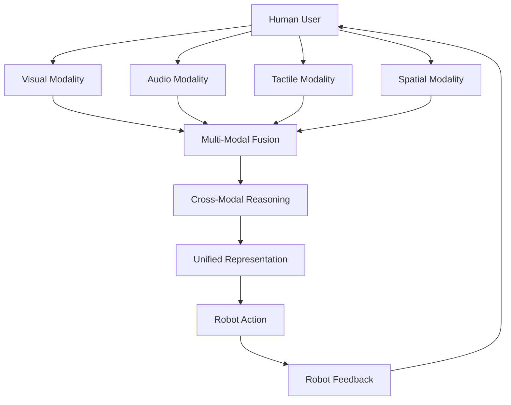

import Callout from '@site/src/components/Callout';

# Chapter 19: Multi-Modal Interaction in Robotics

## Learning Objectives

After completing this chapter, you should be able to:
- Design multi-modal interfaces that combine different sensing and communication modalities
- Integrate visual, auditory, and haptic feedback for enhanced interaction
- Implement cross-modal reasoning for robust human-robot interaction

## Content with Code Examples

Multi-modal interaction in robotics combines multiple sensory channels (vision, audio, touch, etc.) to create more natural and robust human-robot interfaces.

```python
import rclpy
from rclpy.node import Node
from sensor_msgs.msg import Image, CompressedImage, LaserScan
from std_msgs.msg import String, Float32MultiArray
from geometry_msgs.msg import Twist, PoseStamped
from cv_bridge import CvBridge
import numpy as np
import cv2
import json

class MultiModalInteractionNode(Node):
    def __init__(self):
        super().__init__('multi_modal_interaction')
        
        # Initialize CvBridge for image processing
        self.bridge = CvBridge()
        
        # Internal state for multi-modal fusion
        self.vision_data = None
        self.audio_input = ""
        self.tactile_data = None
        self.fusion_result = None
        
        # Publishers
        self.cmd_vel_pub = self.create_publisher(Twist, '/cmd_vel', 10)
        self.interaction_pub = self.create_publisher(String, '/interaction_result', 10)
        self.fusion_pub = self.create_publisher(Float32MultiArray, '/fused_data', 10)
        
        # Subscribers for different modalities
        self.image_sub = self.create_subscription(
            Image, 
            '/camera/rgb/image_raw', 
            self.image_callback, 
            10
        )
        
        self.compressed_image_sub = self.create_subscription(
            CompressedImage, 
            '/camera/rgb/image_compressed', 
            self.compressed_image_callback, 
            10
        )
        
        self.audio_sub = self.create_subscription(
            String, 
            '/audio_transcription', 
            self.audio_callback, 
            10
        )
        
        self.lidar_sub = self.create_subscription(
            LaserScan,
            '/scan',
            self.lidar_callback,
            10
        )
        
        # Timer for multi-modal fusion
        self.fusion_timer = self.create_timer(0.5, self.multi_modal_fusion)

    def image_callback(self, msg: Image):
        """Process RGB image data"""
        try:
            # Convert ROS Image to OpenCV
            cv_image = self.bridge.imgmsg_to_cv2(msg, desired_encoding='bgr8')
            
            # Perform basic object detection
            objects = self.detect_objects(cv_image)
            
            # Store vision data
            self.vision_data = {
                'timestamp': self.get_clock().now().nanoseconds,
                'objects': objects,
                'image_shape': cv_image.shape
            }
            
            self.get_logger().info(f'Detected {len(objects)} objects in image')
            
        except Exception as e:
            self.get_logger().error(f'Error processing image: {e}')

    def compressed_image_callback(self, msg: CompressedImage):
        """Process compressed image data (alternative to raw image)"""
        try:
            # Convert compressed image to OpenCV
            np_arr = np.frombuffer(msg.data, np.uint8)
            cv_image = cv2.imdecode(np_arr, cv2.IMREAD_COLOR)
            
            # Extract visual features
            features = self.extract_visual_features(cv_image)
            
            # Update vision data with features
            if self.vision_data:
                self.vision_data['features'] = features
            else:
                self.vision_data = {
                    'timestamp': self.get_clock().now().nanoseconds,
                    'features': features,
                    'image_shape': cv_image.shape
                }
                
        except Exception as e:
            self.get_logger().error(f'Error processing compressed image: {e}')

    def audio_callback(self, msg: String):
        """Process audio transcription"""
        self.audio_input = msg.data
        self.get_logger().info(f'Audio input: {self.audio_input}')

    def lidar_callback(self, msg: LaserScan):
        """Process LIDAR data for spatial awareness"""
        # Extract relevant information from LIDAR scan
        ranges = np.array(msg.ranges)
        
        # Filter out invalid ranges
        valid_ranges = ranges[(ranges > msg.range_min) & (ranges < msg.range_max)]
        
        # Calculate basic spatial features
        if len(valid_ranges) > 0:
            nearest_obstacle = np.min(valid_ranges)
            free_space_ahead = np.mean(valid_ranges[len(valid_ranges)//2 - 10:len(valid_ranges)//2 + 10])
        else:
            nearest_obstacle = float('inf')
            free_space_ahead = float('inf')
        
        # Store LIDAR data
        self.lidar_data = {
            'timestamp': self.get_clock().now().nanoseconds,
            'nearest_obstacle': nearest_obstacle,
            'free_space_ahead': free_space_ahead,
            'valid_ranges_count': len(valid_ranges)
        }

    def detect_objects(self, image):
        """Detect objects in image using simple color-based segmentation"""
        # Convert to HSV for color-based segmentation
        hsv = cv2.cvtColor(image, cv2.COLOR_BGR2HSV)
        
        # Define color ranges for common objects
        color_ranges = {
            'red': ([0, 50, 50], [10, 255, 255]),
            'blue': ([100, 50, 50], [130, 255, 255]),
            'green': ([40, 50, 50], [80, 255, 255])
        }
        
        objects = []
        for color_name, (lower, upper) in color_ranges.items():
            # Create mask for color range
            mask = cv2.inRange(hsv, np.array(lower), np.array(upper))
            
            # Find contours
            contours, _ = cv2.findContours(mask, cv2.RETR_EXTERNAL, cv2.CHAIN_APPROX_SIMPLE)
            
            # Filter contours by area
            for cnt in contours:
                area = cv2.contourArea(cnt)
                if area > 500:  # Only consider objects larger than 500 pixels
                    # Get bounding box
                    x, y, w, h = cv2.boundingRect(cnt)
                    objects.append({
                        'color': color_name,
                        'bbox': [x, y, x+w, y+h],
                        'area': area
                    })
        
        return objects

    def extract_visual_features(self, image):
        """Extract visual features from image"""
        # Convert to grayscale
        gray = cv2.cvtColor(image, cv2.COLOR_BGR2GRAY)
        
        # Compute histogram
        hist = cv2.calcHist([gray], [0], None, [256], [0, 256])
        
        # Compute edges
        edges = cv2.Canny(gray, 50, 150)
        
        # Calculate basic statistics
        features = {
            'mean_intensity': float(np.mean(gray)),
            'std_intensity': float(np.std(gray)),
            'edge_density': float(np.sum(edges > 0) / (edges.shape[0] * edges.shape[1])),
            'histogram': hist.flatten().tolist()
        }
        
        return features

    def multi_modal_fusion(self):
        """Fuse data from multiple modalities"""
        # Check if we have data from all modalities
        all_modalities_available = True
        modalities = []
        
        if self.vision_data:
            modalities.append(('vision', self.vision_data))
        else:
            all_modalities_available = False
            
        if self.audio_input:
            modalities.append(('audio', self.audio_input))
        else:
            all_modalities_available = False
            
        if hasattr(self, 'lidar_data') and self.lidar_data:
            modalities.append(('lidar', self.lidar_data))
        else:
            all_modalities_available = False
        
        # Perform fusion if all modalities are available
        if all_modalities_available:
            self.get_logger().info('Performing multi-modal fusion')
            
            # Simple fusion: combine all modalities into a single representation
            fusion_result = {
                'timestamp': self.get_clock().now().nanoseconds,
                'fused_modalities': [m[0] for m in modalities],
                'spatial_context': self.lidar_data['free_space_ahead'],
                'visual_content': [obj['color'] for obj in self.vision_data['objects']],
                'audio_content': self.audio_input
            }
            
            # Cross-modal reasoning: if audio mentions an object color, find it in vision
            if self.audio_input:
                for obj in self.vision_data['objects']:
                    if obj['color'] in self.audio_input.lower():
                        fusion_result['target_object'] = obj
                        self.get_logger().info(f'Found target object based on audio: {obj}')
                        
            self.fusion_result = fusion_result
            
            # Publish fused data
            fusion_msg = Float32MultiArray()
            # Convert fusion result to array format for publishing
            # (in a real implementation, this would be more sophisticated)
            fusion_msg.data = [float(self.lidar_data['free_space_ahead']), 
                              len(self.vision_data['objects']), 
                              len(self.audio_input)]
            self.fusion_pub.publish(fusion_msg)
            
            # Publish interaction result
            result_msg = String()
            result_msg.data = json.dumps(fusion_result)
            self.interaction_pub.publish(result_msg)
        else:
            # Not all modalities available, but still try to make sense of available data
            partial_fusion = {
                'timestamp': self.get_clock().now().nanoseconds,
                'available_modalities': [m[0] for m in modalities],
                'is_complete': False
            }
            
            self.fusion_result = partial_fusion
            
            result_msg = String()
            result_msg.data = json.dumps(partial_fusion)
            self.interaction_pub.publish(result_msg)

def main(args=None):
    rclpy.init(args=args)
    interaction_node = MultiModalInteractionNode()
    
    try:
        rclpy.spin(interaction_node)
    except KeyboardInterrupt:
        pass
    finally:
        interaction_node.destroy_node()
        rclpy.shutdown()

if __name__ == '__main__':
    main()
```

## Mermaid Diagrams



## Callouts

<Callout type="info">
Multi-modal systems can provide robustness by using alternative modalities when one fails or is ambiguous.
</Callout>

<Callout type="tip">
Implement cross-modal attention mechanisms that allow information from one modality to guide processing in another.
</Callout>

<Callout type="caution">
Fusing information across modalities requires careful temporal alignment and handling of different data rates.
</Callout>

## Exercises

1. Implement a multi-modal system that combines vision and speech for object manipulation
2. Create a cross-modal attention mechanism for a robot interface
3. Evaluate the robustness of multi-modal vs. single-modal interaction

## Key Takeaways

- Multi-modal interaction combines different sensory channels for richer interaction
- Cross-modal reasoning enables more robust and natural interaction
- Temporal alignment is critical when fusing different modalities