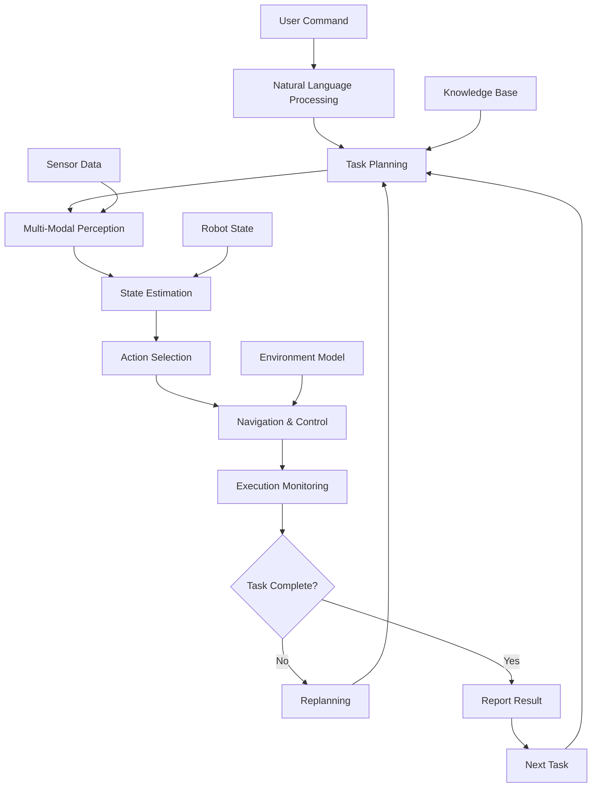

import Callout from '@site/src/components/Callout';

# Chapter 20: Capstone Project - Integrating Physical AI Systems

## Learning Objectives

After completing this chapter, you should be able to:
- Design and implement a complete Physical AI system integrating multiple technologies
- Apply all concepts learned throughout the book in a cohesive project
- Evaluate and optimize the performance of integrated systems

## Content with Code Examples

The capstone project brings together all the concepts learned in this book to create a comprehensive Physical AI system. We'll design and implement a robot that can understand natural language commands, navigate environments, perceive objects, and execute complex tasks.

```python
import rclpy
from rclpy.node import Node
from std_msgs.msg import String, Bool
from geometry_msgs.msg import Twist, PoseStamped
from sensor_msgs.msg import Image, LaserScan
from cv_bridge import CvBridge
import json
import numpy as np
import time
from typing import Dict, List, Optional

class CapstoneRobotController(Node):
    def __init__(self):
        super().__init__('capstone_robot_controller')
        
        # Initialize components
        self.bridge = CvBridge()
        self.current_state = "idle"  # idle, navigating, manipulating, etc.
        self.task_queue = []
        self.robot_capabilities = {
            'navigation': True,
            'manipulation': False,  # Assuming a non-manipulator robot for this example
            'perception': True,
            'communication': True
        }
        
        # Robot state
        self.position = (0.0, 0.0, 0.0)  # x, y, theta
        self.battery_level = 1.0
        self.objects_detected = {}
        self.goal_position = None
        
        # Publishers
        self.cmd_vel_pub = self.create_publisher(Twist, '/cmd_vel', 10)
        self.goal_pub = self.create_publisher(PoseStamped, '/goal_pose', 10)
        self.speech_pub = self.create_publisher(String, '/tts_input', 10)
        self.status_pub = self.create_publisher(String, '/robot_status', 10)
        
        # Subscribers
        self.voice_cmd_sub = self.create_subscription(
            String,
            '/voice_command',
            self.voice_command_callback,
            10
        )
        
        self.image_sub = self.create_subscription(
            Image,
            '/camera/rgb/image_raw',
            self.image_callback,
            10
        )
        
        self.lidar_sub = self.create_subscription(
            LaserScan,
            '/scan',
            self.lidar_callback,
            10
        )
        
        # Timer for state machine
        self.state_timer = self.create_timer(0.1, self.state_machine)
        
        # Navigation feedback
        self.nav_complete_sub = self.create_subscription(
            Bool,
            '/navigation_complete',
            self.navigation_complete_callback,
            10
        )
        
        self.get_logger().info("Capstone Robot Controller initialized")
        self.say("Capstone robot system initialized. Ready for commands.")

    def voice_command_callback(self, msg: String):
        """Process high-level voice commands"""
        command = msg.data.lower()
        self.get_logger().info(f"Received command: {command}")
        
        # Simple command parsing (would be more sophisticated in practice)
        if "go to" in command or "navigate to" in command:
            # Extract target location
            if "kitchen" in command:
                self.add_navigation_task((3.0, 2.0, 0.0), "kitchen")
            elif "living room" in command:
                self.add_navigation_task((1.0, -1.0, 1.57), "living room")
            elif "bedroom" in command:
                self.add_navigation_task((-2.0, 1.0, 3.14), "bedroom")
            else:
                self.say("I don't know where that location is. Please specify kitchen, living room, or bedroom.")
                
        elif "find" in command or "look for" in command:
            # Find objects
            if "ball" in command or "object" in command:
                self.add_perception_task("ball")
            elif "person" in command:
                self.add_perception_task("person")
                
        elif "stop" in command:
            self.stop_robot()
            self.say("Robot stopped")
            
        elif "status" in command or "report" in command:
            self.report_status()
            
        else:
            self.say(f"I don't understand the command: {command}")

    def add_navigation_task(self, target_pos: tuple, location_name: str):
        """Add a navigation task to the queue"""
        task = {
            'type': 'navigation',
            'target': target_pos,
            'location_name': location_name,
            'priority': 1
        }
        
        self.task_queue.append(task)
        self.say(f"Navigation task added: going to {location_name}")

    def add_perception_task(self, target_object: str):
        """Add a perception task to the queue"""
        task = {
            'type': 'perception',
            'target': target_object,
            'priority': 2  # Higher priority than navigation
        }
        
        self.task_queue.insert(0, task)  # Insert at beginning for higher priority
        self.say(f"Perception task added: looking for {target_object}")

    def image_callback(self, msg: Image):
        """Process image data for object detection"""
        try:
            cv_image = self.bridge.imgmsg_to_cv2(msg, desired_encoding='bgr8')
            
            # Detect objects in the image
            detected_objects = self.detect_objects_in_image(cv_image)
            
            # Update robot's knowledge
            for obj in detected_objects:
                self.objects_detected[obj['name']] = {
                    'position': obj['position'],
                    'confidence': obj['confidence'],
                    'timestamp': time.time()
                }
                
        except Exception as e:
            self.get_logger().error(f"Error processing image: {e}")

    def lidar_callback(self, msg: LaserScan):
        """Process LIDAR data for navigation and obstacle avoidance"""
        # Update robot position based on odometry would happen here
        # For this example, we just store the LIDAR data
        
        # Check for obstacles in the immediate vicinity
        min_distance = min([r for r in msg.ranges if r != float('inf')], default=float('inf'))
        
        if min_distance < 0.5:  # Less than 0.5m is too close
            # Emergency stop if obstacle too close
            self.stop_robot()
            self.say("Obstacle detected. Stopping robot.")

    def navigation_complete_callback(self, msg: Bool):
        """Handle navigation completion"""
        if msg.data and self.current_state == "navigating":
            self.current_state = "idle"
            self.say("Navigation task completed.")

    def detect_objects_in_image(self, image):
        """Detect objects in the image using simple color-based detection"""
        # Convert to HSV for color-based segmentation
        hsv = cv2.cvtColor(image, cv2.COLOR_BGR2HSV)
        
        # Define color ranges for common objects
        color_ranges = {
            'red_ball': ([0, 50, 50], [10, 255, 255]),
            'blue_object': ([100, 50, 50], [130, 255, 255]),
            'green_object': ([40, 50, 50], [80, 255, 255])
        }
        
        detected_objects = []
        
        for obj_name, (lower, upper) in color_ranges.items():
            # Create mask for color range
            mask = cv2.inRange(hsv, np.array(lower), np.array(upper))
            
            # Find contours
            contours, _ = cv2.findContours(mask, cv2.RETR_EXTERNAL, cv2.CHAIN_APPROX_SIMPLE)
            
            # Filter contours by area
            for cnt in contours:
                area = cv2.contourArea(cnt)
                if area > 1000:  # Only consider objects larger than 1000 pixels
                    # Get bounding box
                    x, y, w, h = cv2.boundingRect(cnt)
                    
                    # Calculate approximate position relative to image center
                    center_x = x + w/2
                    center_y = y + h/2
                    img_center_x = image.shape[1] / 2
                    
                    # Determine rough direction (left/right/center)
                    if center_x < img_center_x - 50:
                        direction = "left"
                    elif center_x > img_center_x + 50:
                        direction = "right"
                    else:
                        direction = "center"
                        
                    detected_objects.append({
                        'name': obj_name,
                        'position': direction,
                        'confidence': min(area / 5000, 1.0)  # Normalize confidence
                    })
        
        return detected_objects

    def state_machine(self):
        """Main state machine for robot behavior"""
        if self.current_state == "idle" and self.task_queue:
            # Execute next task
            task = self.task_queue.pop(0)
            
            if task['type'] == 'navigation':
                self.current_state = "navigating"
                self.navigate_to_position(task['target'], task['location_name'])
            elif task['type'] == 'perception':
                self.current_state = "perceiving"
                self.perceive_object(task['target'])
                
        # Update status periodically
        self.publish_status()

    def navigate_to_position(self, target_pos: tuple, location_name: str):
        """Navigate to a specific position"""
        self.get_logger().info(f"Navigating to {location_name} at {target_pos}")
        
        goal_msg = PoseStamped()
        goal_msg.header.stamp = self.get_clock().now().to_msg()
        goal_msg.header.frame_id = 'map'
        goal_msg.pose.position.x = float(target_pos[0])
        goal_msg.pose.position.y = float(target_pos[1])
        goal_msg.pose.position.z = 0.0
        
        # Convert theta to quaternion
        theta = target_pos[2]
        goal_msg.pose.orientation.z = np.sin(theta / 2.0)
        goal_msg.pose.orientation.w = np.cos(theta / 2.0)
        
        self.goal_pub.publish(goal_msg)
        self.say(f"Navigating to {location_name}")

    def perceive_object(self, target_object: str):
        """Look for a specific object using camera and image processing"""
        self.get_logger().info(f"Looking for {target_object}")
        
        # In this implementation, we'll check what was detected in the last image
        if target_object in [obj.split('_')[0] for obj in self.objects_detected.keys()]:
            # Object found
            obj = [k for k in self.objects_detected.keys() if target_object in k][0]
            position = self.objects_detected[obj]['position']
            confidence = self.objects_detected[obj]['confidence']
            
            self.say(f"Found {obj} in the {position} area with confidence {confidence:.2f}")
        else:
            # Object not found
            self.say(f"Could not find {target_object} in the current view")
            
        self.current_state = "idle"  # Return to idle after perception task

    def report_status(self):
        """Report current robot status"""
        status = {
            'state': self.current_state,
            'position': self.position,
            'battery': self.battery_level,
            'detected_objects': list(self.objects_detected.keys()),
            'tasks_pending': len(self.task_queue)
        }
        
        status_msg = String()
        status_msg.data = json.dumps(status)
        self.status_pub.publish(status_msg)
        
        self.say(f"Status: I am {self.current_state}, at position {self.position[:2]}, "
                 f"battery at {self.battery_level*100:.1f}%, "
                 f"detected {len(self.objects_detected)} objects, "
                 f"{len(self.task_queue)} tasks pending")

    def stop_robot(self):
        """Stop the robot"""
        cmd = Twist()
        cmd.linear.x = 0.0
        cmd.angular.z = 0.0
        self.cmd_vel_pub.publish(cmd)
        self.current_state = "idle"

    def say(self, text: str):
        """Publish text for TTS"""
        msg = String()
        msg.data = text
        self.speech_pub.publish(msg)
        self.get_logger().info(f"Robot says: {text}")

    def publish_status(self):
        """Publish robot status periodically"""
        status = {
            'state': self.current_state,
            'timestamp': time.time()
        }
        
        status_msg = String()
        status_msg.data = json.dumps(status)
        self.status_pub.publish(status_msg)

def main(args=None):
    rclpy.init(args=args)
    controller = CapstoneRobotController()
    
    try:
        rclpy.spin(controller)
    except KeyboardInterrupt:
        pass
    finally:
        controller.destroy_node()
        rclpy.shutdown()

if __name__ == '__main__':
    main()
```

## Mermaid Diagrams



## Callouts

<Callout type="info">
The capstone project demonstrates how to integrate all the technologies covered in this book: navigation, perception, natural language processing, and multi-modal interaction.
</Callout>

<Callout type="tip">
When implementing complex integrated systems, use state machines or behavior trees to manage the different operational modes and transitions.
</Callout>

<Callout type="caution">
Integration is often the most challenging part of robotics projects. Plan for debugging time and implement good logging and visualization tools.
</Callout>

## Exercises

1. Extend the capstone project to include actual manipulation capabilities
2. Integrate LLMs for high-level task planning in the capstone system
3. Implement a learning component that improves performance over time

## Key Takeaways

- Integration of multiple technologies creates powerful Physical AI systems
- State management and task planning are crucial for complex behaviors
- Real-world deployment requires robustness to handle unexpected situations
- Continuous evaluation and improvement are essential for practical systems

## Conclusion

Congratulations on completing the Physical AI & Humanoid Robotics book! You've now learned:
- ROS 2 fundamentals and advanced concepts
- Simulation environments and digital twins
- Isaac platform for AI-powered robotics
- Vision-language-action models and multimodal interaction
- How to integrate all these technologies in practical systems

You're now equipped to develop sophisticated Physical AI systems that bridge the gap between artificial intelligence and the physical world. The next step is to apply these concepts to your own robotics projects!